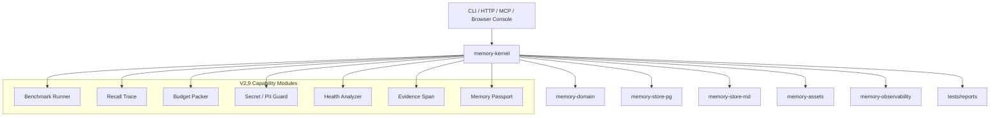

# V2.9 可证明记忆内核总体方案

状态：Planning Draft

更新时间：2026-04-27

## 1. 版本目标

V2.9 的目标不是把 Meat Memory 做成 SaaS，而是把它推进为一个可证明、可解释、可治理、可迁移的 Agent Memory Kernel。

一句话目标：

把 V2.8 已经形成的用户参与式治理闭环，升级为能用 benchmark 证明能力、用 recall trace 解释行为、用 evidence 回溯来源、用 portable bundle 迁移记忆的可信记忆底座。

## 2. 为什么是 V2.9

V2.8 已经补齐 proposal、review、version、rollback、distillation profile 等治理能力。V2.9 继续往前走，重点解决四个问题：

- 能力是否真的强，需要 benchmark 和公开报告证明。
- 召回为什么发生，需要 trace、explanation 和 token budget 决策说明。
- 记忆是否可信，需要引用级 provenance、多模态 evidence 和敏感信息防护。
- 系统是否可控，需要本地优先、可迁移、可压测、可在 Browser Console 中审阅。

因此 V2.9 的定位不是新增一堆入口，而是把记忆系统从“能用”推进到“可信、可测、可运营”。

## 3. 版本边界

### 3.1 V2.9 要做

- 接入公开 benchmark，并建立 Meat Memory 自有中文 + 代码项目 benchmark。
- 为 recall 增加解释、过滤原因、预算裁剪原因和失败样例报告。
- 把 proposal / timeline / rollback 与 recall trace、health report 打通。
- 补齐 secret / PII / 凭证检测，降低错误长期保存和错误召回风险。
- 建立引用级 provenance 和多模态 evidence 的统一模型。
- 提供 Memory Passport，用于本地导出、迁移、恢复和审计。
- 增强 Browser Console，让用户能看到 proposal queue、timeline、recall explanation、health report。
- 增加大规模压测和性能趋势报告。

### 3.2 V2.9 不做

- 不做多租户 SaaS 平台、计费、组织管理和公网托管运营。
- 不默认引入重量级外部服务依赖。
- 不把 benchmark 分数作为唯一目标，必须同时保留安全、治理和可解释性。
- 不让 Agent 自动批准高风险 proposal。
- 不把用户自定义 distillation prompt 变成绕过事实来源和安全基线的后门。
- 不在 V2.9 内完整实现音频 / 视频全链路理解；V2.9 只定义 evidence span 和 passport 的兼容边界。

## 4. 核心原则

- `measurable first`：没有指标和失败样例，就不宣称超越。
- `explain every recall`：每次注入上下文都应能说明命中、过滤、排序和预算原因。
- `evidence before confidence`：先能追溯来源，再谈置信度和自动化。
- `local-first by default`：默认可本地运行、可导出、可审计、可恢复。
- `governance stays human-steerable`：高风险合并、删除、覆盖和跨 scope 发布继续走 proposal / review。
- `benchmark must include safety`：评测不只测命中率，也测泄漏率、误召回、成本和延迟。

## 5. 能力分层

| 层 | 能力 | 说明 |
|---|---|---|
| 评测层 | Benchmark Runner | 统一运行 LoCoMo、LongMemEval、BEAM、Meat Code ZH |
| 解释层 | Recall Trace / Explanation | 记录检索、过滤、排序、budget packing 和注入原因 |
| 预算层 | Recall Budget Packer | 在 token budget 内选择 summary、full content、evidence |
| 治理层 | Proposal / Timeline / Health | 复用 V2.8 治理能力，增加健康报告和运营视图 |
| 安全层 | Secret / PII Guard | 阻止或脱敏高风险内容的长期保存与召回 |
| 证据层 | Provenance / Evidence Span | 追溯到 artifact、文档段落、图片、音频片段、视频片段 |
| 迁移层 | Memory Passport | 支持可导出、可验证、可加密的 portable bundle |
| 接入层 | CLI / HTTP / MCP / Browser Console | 四个 surface 保持语义一致 |

## 6. 小版本拆分

V2.9 拆分为 `V2.91` 到 `V2.96` 六个小版本。每个小版本都必须独立验收，并保持 V2.7 / V2.8 兼容。

| 小版本 | 主题 | 核心目标 |
|---|---|---|
| `V2.91` | Benchmark 基线与兼容契约 | 建立 benchmark runner、Meat Code ZH fixture、报告骨架和老版本兼容底线 |
| `V2.92` | Recall Trace 与 Budget | 让召回过程可解释、可调试、可控成本 |
| `V2.93` | Secret Guard 与 Health Report | 把安全和长期运营风险纳入主链路 |
| `V2.94` | Evidence 与 Memory Passport | 让记忆可追溯、可验证、可迁移 |
| `V2.95` | 竞品兼容与接入面收口 | 对齐 Supermemory / mem0 / MemoryLake 心智，并收口 CLI / HTTP / MCP |
| `V2.96` | UI、压测与生产门禁 | 补 Browser Console、压测、100% 覆盖率和发布门禁 |

详细拆分见 [`V2.9-release-split-roadmap.md`](./V2.9-release-split-roadmap.md)。

## 7. 总体架构



V2.9 不新增新的顶层进程。所有能力优先收敛在 `memory-kernel` 编排，领域对象落在 `memory-domain`，持久化仍由 `memory-store-pg` 和 `memory-store-md` 承担，对外入口继续保持 CLI / HTTP / MCP / Browser Console 四条线。

## 8. 模块增量

| 模块 | 增量职责 |
|---|---|
| `memory-domain` | 增加 benchmark、recall trace、budget pack、evidence span、secret finding、passport manifest 领域对象 |
| `memory-kernel` | 编排 benchmark ingest / query / evaluate、recall explanation、budget packing、health report |
| `memory-store-pg` | 持久化 benchmark run、recall trace、secret finding、passport manifest 元数据 |
| `memory-store-md` | 增加 benchmark / health / passport 的人类可读投影 |
| `memory-http` | 暴露 benchmark、recall trace、health report、passport API |
| `memory-cli` | 增加 benchmark、trace、health、passport、connector 命令 |
| `memory-mcp` | 暴露 Agent 可用但受控的 trace、health、passport 工具 |
| `memory-observability` | 增加 benchmark 指标、召回指标、泄漏指标、budget 指标 |
| `memory-assets` | 扩展 evidence 对音频、视频、导出包的引用能力 |

## 9. 核心对象

| 对象 | 作用 | 最小字段 |
|---|---|---|
| `BenchmarkSuite` | 描述评测集、版本、数据源和评分规则 | `suite_id`、`name`、`version`、`source_uri`、`metric_profile` |
| `BenchmarkRun` | 记录一次评测运行 | `run_id`、`suite_id`、`started_at`、`finished_at`、`config_hash`、`status`、`report_path` |
| `BenchmarkCaseResult` | 记录单条 case 结果 | `case_id`、`run_id`、`query`、`expected_refs`、`actual_refs`、`score`、`latency_ms`、`failure_reason` |
| `RecallTrace` | 记录一次 recall 过程 | `trace_id`、`scope_id`、`query`、`retrieval_mode`、`candidate_count`、`selected_count`、`budget` |
| `RecallExplanation` | 面向用户和 Agent 的解释 | `trace_id`、`summary`、`matched_terms`、`filtered_reasons`、`budget_reasons` |
| `RecallBudgetPack` | 记录预算分配和裁剪 | `pack_id`、`trace_id`、`token_budget`、`used_tokens`、`items`、`trimmed_items` |
| `EvidenceSpan` | 指向 artifact 内的证据位置 | `span_id`、`artifact_id`、`media_kind`、`locator`、`hash`、`confidence` |
| `SecretFinding` | 记录敏感内容检测结果 | `finding_id`、`scope_id`、`source_ref`、`kind`、`action`、`risk_level` |
| `MemoryPassportManifest` | 描述导出包 | `passport_id`、`scope_id`、`object_counts`、`hashes`、`redaction_mode`、`encryption_mode` |

## 10. 核心链路

### 10.1 Benchmark 链路

```text
suite fixture
  -> benchmark runner
  -> ingest memories / project docs / agent context
  -> run query cases
  -> collect recall trace
  -> evaluate expected refs / leakage / latency
  -> write report
```

最小实现先支持 `meat-code-zh` fixture。公开 suite 的 adapter 可以后置，但 runner 的接口要从第一天就支持外部数据集。

### 10.2 Recall Trace 链路

```text
query
  -> normalize
  -> retrieve candidates
  -> lifecycle / scope / sensitivity filtering
  -> ranking
  -> budget packing
  -> final context bundle
  -> recall trace + explanation
```

trace 默认保存摘要，避免存储膨胀。调试模式再保存候选明细。所有 trace 都必须经过敏感信息处理，不能因为“调试可见”绕过安全策略。

### 10.3 Secret / PII Guard 链路

```text
artifact / memory input
  -> detector
  -> finding
  -> action: allow / redact / proposal / deny
  -> audit
```

召回时也要再次检查，避免历史数据或导入数据绕过 ingest guard。

### 10.4 Health Report 链路

```text
scope
  -> scan records / proposals / versions / relations / findings
  -> classify risk
  -> summarize
  -> suggested actions
  -> report projection
```

health report 不直接执行高风险动作。它只生成建议，具体 merge、forget、hard delete、跨 scope 发布继续走 V2.8 proposal / review。

### 10.5 Memory Passport 链路

```text
scope selection
  -> object graph export
  -> redaction / optional encryption
  -> manifest + hashes
  -> bundle
  -> verify
  -> import with scope mapping
```

Passport 默认 portable，但不默认明文暴露敏感内容。导出时必须提供 redaction 摘要和 manifest 校验信息。

## 11. 接口草案

### 11.1 CLI

| 命令 | 用途 |
|---|---|
| `memory-cli benchmark run --suite meat-code-zh` | 运行自有 benchmark |
| `memory-cli benchmark report --run-id <id>` | 查看 benchmark 报告 |
| `memory-cli trace inspect --trace-id <id>` | 查看 recall trace |
| `memory-cli trace latest --scope-id <id>` | 查看最近一次 scope recall |
| `memory-cli health report --scope-id <id>` | 生成记忆健康报告 |
| `memory-cli passport export --scope-id <id> --output <path>` | 导出 Memory Passport |
| `memory-cli passport verify --input <path>` | 校验导出包 |
| `memory-cli passport import --input <path> --target-scope-id <id>` | 导入导出包 |

### 11.2 HTTP

| 路由 | 方法 | 用途 |
|---|---|---|
| `/api/v1/benchmark/runs` | `POST` | 创建 benchmark run |
| `/api/v1/benchmark/runs/{run_id}` | `GET` | 查看 benchmark run |
| `/api/v1/benchmark/runs/{run_id}/report` | `GET` | 查看 report |
| `/api/v1/recall/traces/{trace_id}` | `GET` | 查看 recall trace |
| `/api/v1/recall/traces/{trace_id}/explanation` | `GET` | 查看用户级解释 |
| `/api/v1/health/report` | `POST` | 生成 health report |
| `/api/v1/passports/export` | `POST` | 导出 passport |
| `/api/v1/passports/verify` | `POST` | 校验 passport |
| `/api/v1/passports/import` | `POST` | 导入 passport |

### 11.3 MCP

| 工具 | 用途 | 风险边界 |
|---|---|---|
| `memory.benchmark_report` | 查询 benchmark 报告 | 只读 |
| `memory.trace_latest` | 查询最近 recall explanation | 只读 |
| `memory.trace_inspect` | 查询指定 trace | 需遵守 scope / sensitivity |
| `memory.health_report` | 查询 health summary | 不自动执行建议动作 |
| `memory.passport_manifest` | 查看 passport manifest | 不默认允许导入导出 |

MCP 不应默认暴露重任务执行和高风险导入导出。需要执行时，优先让用户通过 CLI 或 HTTP 控制台触发。

## 12. 存储草案

| 表 / 投影 | 作用 |
|---|---|
| `benchmark_suites` | 记录 suite 元数据 |
| `benchmark_runs` | 记录一次运行 |
| `benchmark_case_results` | 记录 case 级结果 |
| `recall_traces` | 记录 trace 摘要 |
| `recall_trace_candidates` | 可选记录候选摘要 |
| `recall_budget_packs` | 记录 budget 决策 |
| `secret_findings` | 记录敏感检测结果 |
| `evidence_spans` | 记录 artifact 内证据定位 |
| `memory_passports` | 记录导出包 manifest 元数据 |
| Markdown benchmark report | 人类可读评测报告 |
| Markdown health report | 人类可读健康报告 |
| Passport manifest file | 导出包内部清单 |

存储策略：

- PG 作为控制面主存。
- Markdown 作为报告和 manifest 投影，不承载完整控制状态。
- 大型导出包和资产继续走 asset store / filesystem。
- trace 默认摘要化，候选明细按配置保留。

## 13. 报告格式

### 13.1 Benchmark Summary

```text
tests/reports/benchmark/latest/
  summary.md
  metrics.json
  failures.jsonl
  latency.jsonl
  leakage.jsonl
```

核心指标：

- `recall_at_1`
- `recall_at_5`
- `answer_accuracy`
- `p50_latency_ms`
- `p95_latency_ms`
- `token_cost_estimate`
- `leakage_count`
- `blocked_secret_count`
- `failure_reason_counts`

### 13.2 Health Report

```text
tests/reports/health/latest/
  summary.md
  risks.jsonl
  suggested_actions.jsonl
```

风险类型：

- duplicate
- conflict
- expired
- deprecated but recalled
- low confidence
- high sensitivity
- pending proposal
- orphan evidence

### 13.3 Passport Report

```text
tests/reports/passport/latest/
  manifest-summary.md
  verify.json
```

检查项：

- manifest hash
- object count
- missing artifact
- incompatible version
- redaction summary
- encryption mode

## 14. 老版本兼容设计

V2.9 必须是增量演进，不应破坏 V2.7 / V2.8 已经稳定的核心链路。兼容设计遵循三个原则：

- 旧入口继续可用：`remember`、`search`、`fetch_context`、`publish`、`promote`、proposal、timeline、rollback 不能因为 V2.9 新能力改变默认语义。
- 新能力默认可选：benchmark、trace、health、passport 都应支持显式开启；默认运行路径不应强制写入大量 trace。
- 数据迁移只做加法：V2.9 新表、新字段、新投影应尽量 additive，不改写 V2.7 / V2.8 已有事实源。

### 14.1 行为兼容

| 旧能力 | V2.8 行为 | V2.9 行为 | 兼容要求 |
|---|---|---|---|
| `remember` | 写入 artifact / memory，并触发治理规则 | 可额外触发 secret guard 和 trace，但默认返回结构不破坏旧字段 | 旧客户端无需改代码 |
| `search` / `fetch_context` | 返回 context bundle / memories | 可附带 `trace_id` 或 explanation，但必须保持旧 payload 可解析 | 新字段只追加不替换 |
| lifecycle recall guard | 过滤 forgotten / deleted / restricted 等状态 | 继续作为 recall trace 的过滤阶段 | 过滤规则不能被 trace 绕过 |
| proposal / review | 高风险 merge / conflict 进入审批 | health report 可以引用 proposal，但不直接执行动作 | 审批权限不降级 |
| rollback / restore | 通过版本和 audit 恢复 | passport import 可生成 proposal 或 restore plan | 不直接覆盖旧记录 |
| Markdown projection | 人类可读投影 | 新增 benchmark / health / passport 投影 | 旧 memory projection 格式保持可解析 |

### 14.2 接口兼容

| Surface | 兼容策略 |
|---|---|
| CLI | 旧命令参数保持；新增 `benchmark`、`trace`、`health`、`passport` 子命令 |
| HTTP | 旧 `/api/v1/*` 路由保持；V2.9 新路由继续挂在 `/api/v1` 下，payload 只追加字段 |
| MCP | 旧 tool 名称和参数保持；V2.9 新 tool 默认只读或受控 |
| Config | 继续使用 `config/app.toml` + `MEAT_MEMORY_*` 覆盖，不新增平行配置体系 |
| Reports | 继续写入 `tests/reports/`，新增 benchmark / health / passport 分类 |

### 14.3 数据迁移兼容

| 项目 | 策略 |
|---|---|
| PG schema | 新增 V2.9 迁移，不修改 V2.8 表的核心字段语义 |
| Existing rows | 不批量重写旧 memory；需要 backfill 时必须可重复、可跳过、可报告 |
| Trace storage | 新 trace 表默认独立，旧 search 不依赖 trace 表才能运行 |
| Passport import | 默认导入到目标 scope 的 staging / proposal，不静默覆盖现有 memory |
| Downgrade | 回退到 V2.8 时旧功能仍可运行，只是无法读取 V2.9 新表 |

### 14.4 回滚策略

V2.9 出现问题时，回滚优先按以下顺序处理：

1. 关闭 feature flag：禁用 benchmark run、trace detail、passport import 等新能力。
2. 保留 schema：不直接 drop 新表，避免丢失审计和导出记录。
3. 恢复旧入口：确认 `remember/search/fetch_context/proposal/rollback` 仍可通过 V2.8 验收。
4. 报告隔离：V2.9 新报告可以停止生成，但不能影响 V2.8 acceptance。

## 15. 对手能力兼容设计

V2.9 不追求复制竞品 API，而是提供能力兼容和迁移映射，让用户可以把竞品心智映射到 Meat Memory。

### 15.1 能力映射

| 对手 | 对手能力 | Meat Memory 兼容方式 |
|---|---|---|
| Supermemory | container tag / user / project 级隔离 | 映射为 `scope_id`、`owner_scope_id`、`source_key`、access key |
| Supermemory | memory graph / related memories | 映射为 `memory_relations`、entity / relation、recall trace |
| Supermemory | RAG + document chunks | 映射为 ProjectDocument、Markdown projection、evidence span |
| Supermemory | Memory Router / SDK wrapper | V2.9 不做 API proxy；通过 MCP / CLI / HTTP 提供显式 memory workflow |
| mem0 | user / session / agent / org memory | 映射为 user / session / project / team / organization scope |
| mem0 | add / search / update / delete memory | 映射为 remember / search / proposal / forget / restore |
| mem0 | open-source local deployment | 保持本地优先、Docker、CLI、PG + Markdown |
| MemoryLake | Memory Passport | 映射为 `MemoryPassportManifest` + bundle export / import / verify |
| MemoryLake | provenance / source citation | 映射为 evidence span、artifact、source refs、timeline |
| MemoryLake | conflict / version / audit | 复用 V2.8 proposal、version、rollback、audit |

### 15.2 导入导出兼容

| 来源 | V2.9 处理方式 | 风险控制 |
|---|---|---|
| mem0-style JSON | 提供 adapter skeleton，把 user/session/metadata 转为 scope + memory | 默认进入 staging 或 proposal |
| Supermemory-style documents | 以 document source + chunks + evidence span 导入 | 不自动声明来源可信 |
| MemoryLake-style passport | 以 manifest + object graph 方式映射 | 校验 hash、版本、redaction |
| 通用 Markdown | 作为 ProjectDocument / MemorySource 导入 | 保留 source path 和 content hash |
| 通用 JSONL | 作为 benchmark fixture 或 memory import 输入 | 必须通过 schema 校验 |

### 15.3 评测兼容

V2.9 benchmark 报告需要提供对手可比指标：

- `recall_at_1`
- `recall_at_5`
- `answer_accuracy`
- `p95_latency_ms`
- `token_cost_estimate`
- `leakage_count`
- `blocked_secret_count`
- `failure_reason_counts`

对手没有公开的内部指标不强行对齐。所有对比必须标注数据集、模型、运行配置和是否启用本地 / 云端模型。

## 16. 质量门禁与 100% 覆盖率要求

V2.9 新增功能必须按 100% 覆盖率门禁推进。这里的“新增功能”指 V2.9 新增的领域对象、kernel 服务、store 方法、CLI/HTTP/MCP handler、报告 writer 和安全规则。

| 覆盖项 | 要求 |
|---|---|
| 新增生产文件 line coverage | 100% |
| 新增生产文件 function coverage | 100% |
| 新增生产文件 region / branch coverage | 100% |
| 新增 CLI / HTTP / MCP surface | 每个命令、路由、tool 至少有成功、失败、权限或边界测试 |
| 新增迁移 | up migration、重复执行、空库、已有数据兼容测试 |
| 新增报告 | summary、JSON / JSONL、空结果、失败样例测试 |
| 新增安全规则 | allow、redact、proposal、deny、recall block 全路径测试 |
| 新增兼容 adapter | 正常输入、缺字段、未知字段、敏感字段、冲突导入测试 |

生产门禁建议新增：

```text
docs/scripts/v2_9-coverage-threshold.py
docs/scripts/v2_9-production-gate.sh
```

门禁规则：

- V2.9 新增生产文件 line / function / region 必须 100%。
- V2.9 acceptance 必须覆盖 benchmark、trace、budget、secret guard、health、passport、compatibility。
- 如果某个分支无法在当前环境覆盖，不能直接降低阈值，必须拆出可测试单元或把任务标为未完成。
- 覆盖率报告必须写入 `tests/reports/coverage/latest/` 或 V2.9 指定报告目录。

## 17. 里程碑

| 里程碑 | 目标 | 结果 |
|---|---|---|
| `V2.91` | Benchmark 基线与兼容契约 | runner、Meat Code ZH、报告骨架、V2.7 / V2.8 兼容契约 |
| `V2.92` | Recall Trace 与 Budget | trace、explanation、budget packer、failure classifier |
| `V2.93` | Secret Guard 与 Health Report | secret / PII guard、health report、泄漏测试 |
| `V2.94` | Evidence 与 Passport | provenance、evidence span、portable export/import/verify |
| `V2.95` | 竞品兼容与接入面收口 | Supermemory / mem0 / MemoryLake 映射、adapter skeleton、surface parity |
| `V2.96` | UI、压测与生产门禁 | Browser Console、10K / 100K / 1M 压测、100% 覆盖率、V2.9 production gate |

## 18. 建议实现顺序

1. 先做 benchmark runner 和最小 Meat Code ZH 数据集。
2. 再做 recall trace，让 benchmark 的失败样例能解释。
3. 接入 recall budget packer，控制 token 成本和上下文注入质量。
4. 补 secret / PII guard，确保 benchmark 同时覆盖安全泄漏。
5. 做 health report，把重复、冲突、过期、低置信度、高敏感和无人审阅项暴露出来。
6. 做 evidence span 和 Memory Passport，支撑迁移、恢复和来源追踪。
7. 做老版本兼容回归和对手能力映射 adapter。
8. 最后做 Browser Console、surface parity、100% 覆盖率和生产门禁收口。

## 19. 验收目标

V2.9 完成时，至少满足以下目标：

- `memory-cli benchmark run --suite meat-code-zh` 可生成 `tests/reports/benchmark/latest/summary.md`。
- 至少一个公开 benchmark suite 可一键运行，或在缺少数据集时提供清晰的下载和跳过说明。
- 每次 `fetch_context` 或等价 recall 路径都能生成可选 `RecallTrace`。
- Recall Explanation 能说明命中原因、过滤原因、排序原因和预算裁剪原因。
- Secret / PII guard 能阻止 API key、token、私密路径、凭证正文被默认长期保存。
- Health Report 能输出重复、冲突、过期、低置信度、高敏感、无人审阅记忆。
- Memory Passport 能导出指定 scope 的 portable bundle，并能在本地恢复。
- CLI / HTTP / MCP 至少三者中的两个具备 benchmark、trace、health、passport 主链路，剩余一个不缺核心语义。
- V2.9 acceptance 和 production gate 能进入 `docs/scripts/` 与 `tests/reports/`。
- V2.7 / V2.8 核心入口兼容测试全部通过。
- Supermemory / mem0 / MemoryLake 的关键能力映射有 fixture 或 adapter skeleton 覆盖。
- V2.9 新增功能生产代码 line / function / region coverage 达到 100%。
- `V2.91` 到 `V2.96` 每个小版本都有独立验收结果和覆盖率报告。

## 20. 风险与控制

| 风险 | 说明 | 控制方式 |
|---|---|---|
| 只追 benchmark 分数 | 可能牺牲安全和治理 | 指标必须同时包含泄漏率、误召回、成本和延迟 |
| 数据集接入过重 | 公开 benchmark 数据格式和依赖复杂 | 先做 adapter trait 与小型 fixture，再接完整数据 |
| trace 数据过大 | 每次召回记录全量候选会膨胀 | 默认保留摘要，debug 模式保留详细候选 |
| secret 误杀 | 敏感检测过严影响正常记忆 | 使用 proposal / review 和可解释 finding |
| Passport 安全风险 | 导出包可能携带敏感数据 | 默认支持 redaction、manifest hash、可选加密 |
| UI 过早复杂 | Browser Console 可能拖慢核心能力 | 先做只读运营视图，再做交互操作 |
| 兼容承诺过宽 | 试图完整复制对手 API 会拖慢核心能力 | 优先能力映射和 adapter skeleton，不承诺克隆全部 API |
| 100% 覆盖率难以维护 | 复杂集成分支可能脆弱 | 拆分纯函数和可测试服务，集成层只保留薄适配 |

## 21. 文档结构

- [`V2.9-overall-plan.md`](./V2.9-overall-plan.md)：V2.9 总体方案
- [`V2.9-release-split-roadmap.md`](./V2.9-release-split-roadmap.md)：V2.91 到 V2.96 小版本拆分路线图
- [`V2.9-competitive-feature-checklist.md`](./V2.9-competitive-feature-checklist.md)：超越竞品功能清单与竞品备注
- [`V2.9-tasklist.md`](./V2.9-tasklist.md)：V2.9 版本化任务清单

## 22. 与相邻版本的关系

| 版本 | 重点 | V2.9 关系 |
|---|---|---|
| V2.7 | lifecycle、recall guard、forget / restore、audit | V2.9 复用 recall guard，并增加 trace 和 benchmark |
| V2.8 | proposal、version、rollback、distillation profile | V2.9 复用治理闭环，并增加 health report 和可证明能力 |
| V3 | 音频、视频、全多模态 | V2.9 先定义 evidence span 和 passport，为 V3 多模态落地做底座 |

## 23. 当前结论

V2.9 最重要的工程判断是：

先把“能力可证明、召回可解释、来源可追溯、记忆可迁移”坐实，再继续扩展更复杂的多模态和产品 UI。这样可以避免系统表面功能变多，但用户仍然不知道它为什么记、为什么搜、为什么删、为什么可信。
