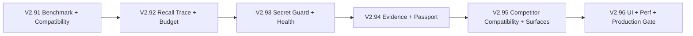

# V2.9 小版本拆分路线图

状态：Planning Draft

更新时间：2026-04-27

## 1. 拆分原则

V2.9 拆分为 `V2.91` 到 `V2.96` 六个小版本。拆分目标是让每个版本都有独立价值、可验收边界和回滚路径，避免把 benchmark、trace、security、passport、UI、压测全部挤进一个大版本。

拆分原则：

- 每个小版本都必须能独立通过当前主线回归。
- 每个小版本只引入一组主能力，避免跨层大爆炸。
- 每个小版本新增生产代码必须达到 line / function / region 100% 覆盖率。
- 每个小版本都必须保持 V2.7 / V2.8 行为、接口、数据和 Markdown projection 兼容。
- 对手能力兼容以 adapter skeleton 和 fixture 先行，不承诺一次性完整克隆竞品 API。

## 2. 小版本总览

| 小版本 | 主题 | 核心目标 | 交付形态 |
|---|---|---|---|
| `V2.91` | Benchmark 基线与兼容契约 | 先把能力变得可测，并固定老版本兼容底线 | benchmark runner、Meat Code ZH fixture、兼容契约、报告骨架 |
| `V2.92` | Recall Trace 与 Budget | 让每次召回可解释、可调试、可控成本 | trace、explanation、budget packer、失败分类 |
| `V2.93` | Secret Guard 与 Health Report | 把安全和长期运营风险纳入主链路 | secret / PII guard、health analyzer、risk report |
| `V2.94` | Evidence 与 Memory Passport | 让记忆可追溯、可迁移、可验证 | evidence span、provenance query、passport export/import/verify |
| `V2.95` | 竞品兼容与接入面收口 | 对齐 Supermemory / mem0 / MemoryLake 心智，并收口 CLI/HTTP/MCP | 能力映射、adapter skeleton、surface parity |
| `V2.96` | UI、压测与生产门禁 | 把 V2.9 从能力完成推进到可发布 | Browser Console 视图、10K/100K/1M 压测、100% 覆盖率门禁 |

## 3. V2.91 Benchmark 基线与兼容契约

### 3.1 目标

V2.91 先解决“如何证明系统变强”和“如何不破坏旧版本”两个问题。

### 3.2 范围

- 建立 `BenchmarkSuite`、`BenchmarkRun`、`BenchmarkCaseResult` 最小领域模型。
- 定义 benchmark runner trait，支持 ingest、query、evaluate、report。
- 建立 `meat-code-zh` 小型 fixture。
- 输出 benchmark summary、metrics、failures、latency、leakage 报告骨架。
- 固定 V2.7 / V2.8 行为兼容契约、接口兼容契约、schema 迁移兼容设计。

### 3.3 不做

- 不接完整 LoCoMo / LongMemEval / BEAM。
- 不做复杂 LLM judge。
- 不改动旧 `remember/search/fetch_context` 默认返回语义。

### 3.4 任务范围

| 范围 | 任务 |
|---|---|
| 文档 | `V2.9-DOC-002` |
| 领域 | `V2.9-DOM-001` |
| 设计 | `V2.9-DES-001`、`V2.9-COMPAT-001`、`V2.9-COMPAT-002`、`V2.9-COMPAT-003` |
| 存储 | `V2.9-STO-001` |
| Benchmark | `V2.9-BEN-001`、`V2.9-BEN-002`、`V2.9-BEN-006`、`V2.9-BEN-007` |
| QA | `V2.9-QA-001`、`V2.9-QA-008`、`V2.9-QA-010` |

### 3.5 验收

- `memory-cli benchmark run --suite meat-code-zh` 能生成本地报告。
- benchmark 报告包含 recall@1、recall@5、latency、leakage、failure reason。
- V2.7 / V2.8 核心入口兼容回归通过。
- V2.91 新增生产代码 line / function / region coverage 为 100%。

## 4. V2.92 Recall Trace 与 Budget

### 4.1 目标

V2.92 让召回从“返回结果”升级为“可解释的决策过程”。

### 4.2 范围

- 建立 `RecallTrace`、`RecallExplanation`、`RecallBudgetPack` 领域对象。
- 在 search / fetch_context 主链路采集 trace。
- 生成命中、过滤、排序、budget、未召回原因。
- 增加 recall failure classifier，服务 benchmark 和用户调试。
- 增加 trace retention policy，避免 trace 数据膨胀和敏感泄漏。

### 4.3 不做

- 不改变旧 search 默认排序承诺。
- 不把完整候选明细默认写入长期存储。
- 不让 trace 绕过 lifecycle / sensitivity / scope guard。

### 4.4 任务范围

| 范围 | 任务 |
|---|---|
| 领域 | `V2.9-DOM-002`、`V2.9-DOM-003`、`V2.9-DOM-004` |
| 设计 | `V2.9-DES-002` |
| 存储 | `V2.9-STO-002` |
| Recall | `V2.9-REC-001`、`V2.9-REC-002`、`V2.9-REC-003`、`V2.9-REC-004`、`V2.9-REC-005` |
| API | `V2.9-CLI-002`、`V2.9-API-002`、`V2.9-MCP-002` |
| OBS | `V2.9-OBS-002` |
| QA | `V2.9-QA-002`、`V2.9-QA-003`、`V2.9-QA-007` |

### 4.5 验收

- search / fetch_context 可返回或关联 `trace_id`。
- trace explanation 能解释命中、过滤、排序、预算裁剪。
- benchmark failure 能关联到 trace。
- V2.92 新增生产代码 line / function / region coverage 为 100%。

## 5. V2.93 Secret Guard 与 Health Report

### 5.1 目标

V2.93 把安全风险和记忆健康风险变成可检测、可报告、可治理的对象。

### 5.2 范围

- 建立 `SecretFinding` 领域对象。
- 实现 secret / PII detector。
- 实现 ingest guard 和 recall guard。
- 支持 allow、redact、proposal、deny、recall block 全动作。
- 建立 health analyzer，识别重复、冲突、过期、低置信度、高敏感、无人审阅、orphan evidence。
- 输出 health report projection。

### 5.3 不做

- 不默认 hard delete。
- 不自动执行 health report 的高风险建议动作。
- 不用不可解释的黑盒规则替代 proposal / review。

### 5.4 任务范围

| 范围 | 任务 |
|---|---|
| 领域 | `V2.9-DOM-006` |
| 存储 | `V2.9-STO-003`、`V2.9-STO-004` |
| 安全 | `V2.9-SEC-001`、`V2.9-SEC-002`、`V2.9-SEC-003`、`V2.9-SEC-004` |
| Health | `V2.9-HEALTH-001`、`V2.9-HEALTH-002`、`V2.9-HEALTH-003` |
| API | `V2.9-CLI-003`、`V2.9-API-003`、`V2.9-MCP-003` |
| OBS | `V2.9-OBS-003` |
| QA | `V2.9-QA-004`、`V2.9-QA-007` |

### 5.5 验收

- secret / PII 样例能被检测并执行正确 action。
- restricted / secret finding 不会被错误召回。
- health report 能输出风险列表和建议动作。
- V2.93 新增生产代码 line / function / region coverage 为 100%。

## 6. V2.94 Evidence 与 Memory Passport

状态：Implemented

### 6.1 目标

V2.94 让记忆从“系统里的一条记录”升级为“可追溯、可验证、可迁移的资产”。

### 6.2 范围

- 建立 `EvidenceSpan` 和 `MemoryPassportManifest`。
- 支持 text / image / audio / video 的 evidence locator 统一表达，V2.94 完成统一模型和文本 / 多媒体 baseline。
- 提供 provenance query service。
- 提供 passport export / import / verify。
- passport 默认支持 sensitive redaction、manifest hash 和 object hash verification。

### 6.3 不做

- 不在 V2.94 完整实现音频 / 视频理解。
- 不默认明文导出敏感内容。
- 不静默覆盖目标 scope 现有 memory。

### 6.4 任务范围

| 范围 | 任务 |
|---|---|
| 领域 | `V2.9-DOM-005`、`V2.9-DOM-007` |
| 设计 | `V2.9-DES-003` |
| Evidence | `V2.9-EVD-001`、`V2.9-EVD-002`、`V2.9-EVD-003` |
| Passport | `V2.9-PASS-001`、`V2.9-PASS-002`、`V2.9-PASS-003`、`V2.9-PASS-004` |
| API | `V2.9-CLI-004`、`V2.9-API-004`、`V2.9-MCP-004` |
| QA | `V2.9-QA-002`、`V2.9-QA-007` |

### 6.5 验收

- 指定 scope 可导出 passport bundle。
- bundle verify 能检查 manifest hash、object hash、object count 和 version compatibility。
- passport import 支持 target scope mapping 和 id mapping，避免跨 scope 静默覆盖。
- V2.94 新增生产代码 line / function / region coverage 为 100%。

## 7. V2.95 竞品兼容与接入面收口

### 7.1 目标

V2.95 对齐 Supermemory、mem0、MemoryLake 的关键能力心智，并让 CLI / HTTP / MCP 语义一致。

### 7.2 范围

- Supermemory 能力映射：container/user/project、memory graph、document RAG、connector 心智。
- mem0 能力映射：user/session/agent/org、add/search/delete、OSS local。
- MemoryLake 能力映射：passport、provenance、conflict、version、audit。
- 竞品导入 adapter skeleton：mem0-style JSON、Supermemory-style documents、MemoryLake-style passport。
- CLI / HTTP / MCP surface parity。
- Local Git connector、Markdown docs connector、chat export connector skeleton。

### 7.3 不做

- 不克隆竞品私有 API。
- 不承诺对所有竞品导出格式完全兼容。
- 不自动信任外部导入数据。

### 7.4 任务范围

| 范围 | 任务 |
|---|---|
| 兼容 | `V2.9-COMPAT-004` |
| 竞品 | `V2.9-COMPET-001`、`V2.9-COMPET-002`、`V2.9-COMPET-003`、`V2.9-COMPET-004` |
| Connector | `V2.9-CONN-001`、`V2.9-CONN-002`、`V2.9-CONN-003` |
| API | `V2.9-CLI-001`、`V2.9-API-001`、`V2.9-MCP-001` |
| QA | `V2.9-QA-003`、`V2.9-QA-008`、`V2.9-QA-009`、`V2.9-QA-007` |

### 7.5 验收

- Supermemory / mem0 / MemoryLake 的映射 fixture 全部通过。
- CLI / HTTP / MCP 对 benchmark、trace、health、passport 的核心语义一致。
- 旧 Markdown projection 继续可解析。
- V2.95 新增生产代码 line / function / region coverage 为 100%。

## 8. V2.96 UI、压测与生产门禁

### 8.1 目标

V2.96 是 V2.9 的发布收口版本，把能力变成可观察、可压测、可发布的状态。

### 8.2 范围

- Browser Console benchmark view。
- Browser Console recall trace view。
- Browser Console health view。
- Browser Console passport view。
- benchmark metrics、recall metrics、security metrics。
- 10K / 100K / 1M memory benchmark skeleton。
- V2.9 acceptance script。
- V2.9 production gate。
- V2.9 coverage threshold。

### 8.3 不做

- 不做 SaaS dashboard。
- 不做复杂多用户运营后台。
- 不把 UI 操作做成绕过 proposal / review 的捷径。

### 8.4 任务范围

| 范围 | 任务 |
|---|---|
| UI | `V2.9-UI-001`、`V2.9-UI-002`、`V2.9-UI-003`、`V2.9-UI-004` |
| OBS | `V2.9-OBS-001`、`V2.9-OBS-002`、`V2.9-OBS-003` |
| PERF | `V2.9-PERF-001`、`V2.9-PERF-002`、`V2.9-PERF-003` |
| QA | `V2.9-QA-005`、`V2.9-QA-006`、`V2.9-QA-007`、`V2.9-QA-010` |

### 8.5 验收

- `docs/scripts/v2_9-acceptance.sh` 通过。
- `docs/scripts/v2_9-production-gate.sh` 通过。
- `docs/scripts/v2_9-coverage-threshold.py` 确认新增生产代码 line / function / region coverage 为 100%。
- benchmark / perf / security / coverage / e2e 报告写入 `tests/reports/`。
- V2.96 发布说明能清楚列出 V2.91 到 V2.96 的能力闭环。

## 9. 版本依赖关系

`V2.91` 是所有后续小版本的底座，因为 benchmark 和兼容契约决定后续功能是否可证明、是否不破坏旧行为。`V2.96` 是发布收口，不应承载新的高风险核心语义。

## 10. 完成定义

V2.9 整体完成时，必须满足：

- `V2.91` 到 `V2.96` 各自验收通过。
- 每个小版本新增生产代码 line / function / region coverage 为 100%。
- V2.7 / V2.8 核心兼容回归通过。
- Supermemory / mem0 / MemoryLake 关键能力映射 fixture 通过。
- V2.9 acceptance、production gate、coverage threshold 全部通过。
- V2.9 总报告能串起 benchmark、trace、security、health、passport、compatibility、coverage、perf 结果。
