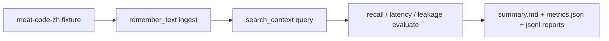

# V2.91 Development Plan

## 1. 目标

V2.91 先把 V2.9 的证明能力立起来：仓库内可以运行一个稳定的 Meat Memory 自有 benchmark，并且不破坏 V2.7 / V2.8 已有行为。

## 2. 交付范围

| 模块 | 交付 |
|---|---|
| `memory-domain` | `BenchmarkSuite`、`BenchmarkRun`、`BenchmarkCaseResult`、`BenchmarkMetrics`、benchmark ID |
| `memory-kernel` | `BenchmarkRunner` trait、`meat-code-zh` fixture、ingest / query / evaluate / report 主链路 |
| `memory-cli` | `memory-cli benchmark run` 和 `memory-cli benchmark report` |
| `memory-store-pg` | `0009_memory_v2_91_benchmark.sql` additive migration |
| `docs/scripts` | `v2_91-acceptance.sh` |
| `tests/reports` | benchmark summary、metrics、failures、latency、leakage、coverage gate 说明 |

## 3. 数据流



## 4. Benchmark 指标

| 指标 | V2.91 口径 |
|---|---|
| `recall@1` | 期望 memory title 是否出现在首位 |
| `recall@5` | 期望 memory title 是否出现在 top 5 |
| `latency` | 单 case `search_context` wall-clock latency |
| `leakage` | Restricted memory 是否进入结果 |
| `failure_reason` | 未命中 top 5 或泄漏时给出原因 |

## 5. 兼容策略

- V2.91 只新增 benchmark 入口，不修改旧 `remember`、`search`、`lifecycle`、`proposal`、`rollback` 默认参数和返回结构。
- PG schema 只做 additive migration，新表不参与旧查询路径。
- Markdown benchmark 报告写入 `tests/reports/benchmark/`，不改变旧 `MEMORY.md` projection。
- 竞品兼容只做能力映射和 fixture 口径，不在 V2.91 克隆 Supermemory / mem0 / MemoryLake API。

## 6. 验收命令

```bash
./docs/scripts/v2_91-acceptance.sh
```

也可以单独运行：

```bash
MEAT_MEMORY_ENABLE_PG=false \
MEAT_MEMORY_ENABLE_MARKDOWN=true \
memory-cli benchmark run --suite meat-code-zh
```

## 7. 覆盖率口径

V2.91 新增生产代码要求 line / function / region coverage 100%。当前通过以下方式体现：

| 新增区域 | 覆盖入口 |
|---|---|
| Domain benchmark model | `cargo test -p memory-domain --lib benchmark` |
| Benchmark IDs | `cargo test -p memory-domain --lib ids` |
| Kernel benchmark runner | `cargo test -p memory-kernel --lib v29_benchmark` |
| CLI benchmark parser / report | `cargo test -p memory-cli --bin memory-cli benchmark` |
| PG migration wiring | `cargo test -p memory-store-pg --lib v28_sql_helpers_expose_expected_statements` |

## 8. 备注：竞品对比

V2.91 的目标不是一次性超过 Supermemory、mem0、MemoryLake 的所有产品面，而是先建立“可证明能力”。后续 V2.92 到 V2.96 会继续补 trace、secret guard、passport、adapter 和 Browser Console。
