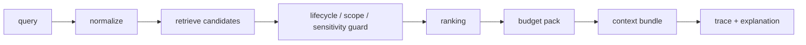

# V2.92 Development Plan

## 1. 目标

V2.92 把召回从“返回一组 memory”升级为“可解释、可调试、可控预算”的 recall trace。旧 `search_context` 语义保持不变，新能力通过 traced search 和 CLI trace 入口显式使用。

## 2. 交付范围

| 模块 | 交付 |
|---|---|
| `memory-domain` | `RecallTrace`、`RecallTraceExplanation`、`RecallBudgetPack`、failure classification、trace / budget ID |
| `memory-kernel` | `search_context_with_trace`、候选 / 过滤 / 排序 / budget pack / explanation 主链路 |
| `memory-cli` | `memory-cli trace latest` 和 `memory-cli trace inspect` |
| `memory-observability` | V2.9 recall trace、hit、filtered、budget trim 指标 |
| `memory-store-pg` | `0010_memory_v2_92_recall_trace.sql` additive migration |
| `docs/scripts` | `v2_92-acceptance.sh` |
| `tests/reports` | trace JSON、explanation、budget、coverage gate 说明 |

## 3. 数据流



## 4. Budget 口径

| 字段 | 含义 |
|---|---|
| `max_records` | 最多注入 memory 数 |
| `max_chars` | V2.92 先用字符预算近似 token budget |
| `used_chars` | 已使用字符数 |
| `trimmed_items` | 因 record limit 或 char budget 被裁剪的 memory |
| `render_mode` | `full`、`summary`、`truncated` |

## 5. 兼容策略

- 旧 `search_context` 不追加必填字段，不改变排序和返回结构。
- `search_context_with_trace` 是新入口，trace 默认只记录摘要信息和 memory title，不保存完整候选正文。
- Restricted / forgotten / deleted 等过滤仍由 `RecallGuard` 决定，trace 只解释过滤，不绕过过滤。
- PG schema 只新增 trace 相关表，旧查询路径不依赖新表。

## 6. 验收命令

```bash
./docs/scripts/v2_92-acceptance.sh
```

也可以单独运行：

```bash
MEAT_MEMORY_ENABLE_PG=false \
MEAT_MEMORY_ENABLE_MARKDOWN=true \
memory-cli trace latest --scope-id scp_demo --query "trace budget" --debug-candidates
```

## 7. 备注：竞品对比

V2.92 对齐并强化 Supermemory / mem0 常见的“为什么召回这条记忆”能力：不仅给结果，还给候选、过滤、排序和预算裁剪原因。MemoryLake 方向的 provenance / passport 仍放在 V2.94。
