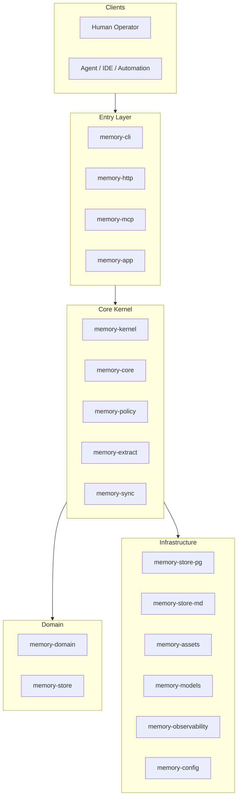

# Meat Memory 架构设计

本文档描述当前仓库的实现基线，重点解释模块边界、数据流向和部署形态，帮助维护者快速理解系统为什么这样拆分。

## 1. 设计目标

系统核心目标有四个：

- 为 Agent 提供稳定、可检索、可演进的长期记忆能力
- 同时兼容 CLI、HTTP、MCP 三种接入方式
- 让结构化主存、Markdown 投影和资产文件可以协同工作
- 让本地开发、自托管部署和后续云化形态共用同一套核心内核

## 2. 系统分层



## 3. Workspace 模块职责

### 3.1 进程与入口

- `memory-app`：应用主入口，装配 HTTP、MCP、配置和观测能力
- `memory-worker`：后台工作进程入口
- `memory-cli`：命令行入口，负责运维命令、交互式初始化、导出 skill、调用内核

### 3.2 核心业务层

- `memory-kernel`：编排 remember、search、publish、promote、context、docs sync 等主流程
- `memory-core`：领域服务抽象与核心依赖拼接
- `memory-policy`：权限、可见性、发布和治理规则
- `memory-sync`：同步、oplog、合并和状态跟踪
- `memory-extract`：抽取与转换能力

### 3.3 领域与存储抽象

- `memory-domain`：领域对象、标识、生命周期、元数据
- `memory-store`：存储层 trait 抽象
- `memory-store-pg`：PostgreSQL 持久化实现
- `memory-store-md`：Markdown 投影与文档组织实现

### 3.4 基础设施

- `memory-models`：多模型 provider catalog 与能力路由
- `memory-assets`：图片等资产文件处理
- `memory-observability`：日志、trace、指标
- `memory-config`：配置加载和环境变量覆盖
- `memory-http` / `memory-mcp`：协议适配层

## 4. 核心数据流

### 4.1 写入记忆

1. 客户端通过 CLI、HTTP 或 MCP 发起写入。
2. 入口层完成参数解析和请求校验。
3. `memory-kernel` 调用 policy、extract、store。
4. 结构化数据进入 PostgreSQL。
5. 可投影内容写入 Markdown。
6. 图片等二进制内容进入 asset store。
7. 观测层记录 trace、日志与指标。

### 4.2 检索记忆

1. 客户端提交 query、scope、limit 等参数。
2. `memory-kernel` 先确定检索边界和权限。
3. 根据场景从 PostgreSQL、Markdown 投影或同步状态中取数。
4. 返回裁剪后的上下文给调用方。

### 4.3 文档同步

1. 用户先定义 source。
2. `docs sync` 扫描本地目录或来源。
3. 内核计算新增、缺失和冲突项。
4. 结果写入存储，并保留冲突供人工确认。

## 5. 存储设计

当前实现采用三类存储协作：

- PostgreSQL：主事实源，保存结构化对象、关系、同步元数据
- Markdown：人类可读投影，便于 repo 协作和文档检视
- Assets：图片等二进制文件目录

这种设计的取舍是：

- 优点：既能做结构化查询，又保留可读文档产物
- 代价：需要维护投影一致性和同步策略

## 6. 配置设计

配置基线为：

```text
config/
  app.toml
```

部署差异通过 `MEAT_MEMORY_*` 环境变量覆盖。这样做的目的有两个：

- 避免维护本地、Docker、云端多份几乎重复的 TOML
- 让 CLI、应用进程和容器环境共享同一套配置模型

典型覆盖项包括：

- `MEAT_MEMORY_CONFIG`
- `MEAT_MEMORY_SERVER_BIND`
- `MEAT_MEMORY_DATABASE_URL`
- `MEAT_MEMORY_MARKDOWN_ROOT`
- `MEAT_MEMORY_ASSETS_ROOT`
- `MEAT_MEMORY_ENABLE_MCP`

## 7. 部署形态

### 7.1 本地开发

- `./docs/scripts/dev-db-up.sh` 只起数据库
- `cargo run -p memory-app` 启主服务
- 适合本地调试和单步排查

### 7.2 本地完整试跑

- `./docs/scripts/dev-up.sh` 起 `pgvector + app + worker`
- `./docs/scripts/dev-down.sh` 停止整套环境
- 适合集成验证和对外演示

### 7.3 云端准备

当前仓库已经保留云部署骨架，重点在：

- 统一配置模型
- 标准健康检查
- 明确状态目录和卷
- 给后续 Helm / 容器编排留接口

## 8. 测试与质量保障

仓库的测试布局分为：

- `tests/unit`
- `tests/integration`
- `tests/e2e`
- `tests/perf`
- `tests/security`
- `tests/reports`

质量保障策略是：

- 用 Rust crate 自带测试覆盖局部逻辑
- 用 acceptance script 覆盖真实使用链路
- 用报告目录保留最近一次和历史归档

## 9. 维护建议

新增能力时，建议优先遵守这些边界：

- 领域对象先落到 `memory-domain`
- 业务编排优先放 `memory-kernel`
- 协议变更尽量收敛在 `memory-http` 或 `memory-mcp`
- 存储实现通过 `memory-store` trait 扩展
- 对外文档同步更新到 `README`、`docs/README` 和对应目录 `README`

## 10. 关联文档

- [`docs/architecture/README.md`](README.md)
- [`docs/runbook/usage-guide.md`](../runbook/usage-guide.md)
- [`docs/meat-memory-scheme-v3.md`](../meat-memory-scheme-v3.md)
- [`docs/api/README.md`](../api/README.md)
