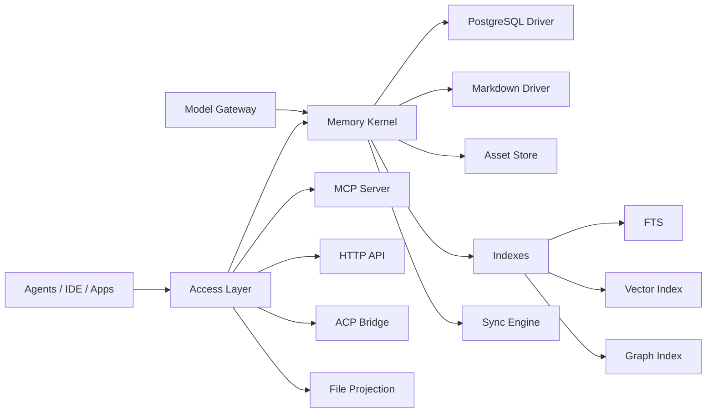

# Meat Memory Scheme V1

状态：Draft V1

更新时间：2026-04-01

目标语言：Rust

目标开发环境：macOS

## 1. 文档目标

本文档定义 `Meat Memory` 的 V1 架构方案。该系统是一个纯自研的长期 Memory 内核，目标不是做一个简单的聊天记录归档器，而是做一个面向多 Agent、多模型、多团队、多模态和多部署形态的统一 Memory OS。

本方案优先回答以下问题：

- 长期 Memory 的内核边界是什么
- 如何同时支持 PostgreSQL 与 Markdown 文件系统
- 如何支持本地、云端和混合部署
- 如何兼容多种 AI Code Agent 与办公 Agent
- 如何跨 Gemini、Claude、ChatGPT、千问、豆包、MiniMax、GLM 等模型工作
- 如何支持个人、项目、团队和组织级别的隔离与合并
- 如何支持文本、图片、语音、视频等多模态内容
- 如何在 V1 就预埋知识图谱和多语言能力

## 2. 设计结论

V1 的核心结论如下：

- 系统核心应是 `Memory Kernel`，而不是某个 Agent 的插件。
- 协议层应以 `MCP` 为主，辅以 `HTTP API`、`ACP Bridge` 和 `File Projection`。
- 存储层采用 `PostgreSQL + Markdown FS` 双驱动，支持独立部署与混合部署。
- 统一领域模型必须独立于模型厂商、Agent 厂商和数据库实现。
- 写入链路必须保留原始证据，并将 `Artifact`、`Episode`、`Memory`、`Entity`、`Relation` 分层处理。
- 团队和个人数据不做粗暴合并，而采用 `Scope Overlay + Published Memory` 的模式。
- 知识图谱第一版直接落 PostgreSQL，不单独引入图数据库。
- 多模型支持通过 `Model Gateway` 实现，推理模型、Embedding 模型和工具模型彻底解耦。

## 3. 纯自研边界

“纯自研”指：

- 自研统一数据模型
- 自研 Memory Kernel
- 自研写入、蒸馏、检索、同步、权限、投影、图谱抽取流程
- 自研 MCP Server、HTTP API、同步协议和文件投影逻辑
- 自研 PostgreSQL Driver 与 Markdown Driver

“纯自研”不指：

- 自研数据库
- 自研向量数据库内核
- 自研 FFmpeg、OCR、ASR 或底层 Embedding 算法
- 自研对象存储
- 自研网络框架、异步运行时或序列化框架

因此本项目允许使用成熟基础设施，例如：

- Rust 生态基础库
- PostgreSQL
- FFmpeg
- 外部模型 API
- 本地文件系统与对象存储

## 4. 核心设计原则

### 4.1 证据优先

任何长期 Memory、实体关系或知识图谱边都必须能追溯到原始证据。没有证据的内容不得直接提升为 durable memory。

### 4.2 模型无关

内部对象模型不能依赖 OpenAI、Anthropic、Gemini、千问等任意一家模型返回格式。模型只是能力提供者，不是事实标准。

### 4.3 Agent 无关

Codex、Claude Code、TRAE、Qoder、OpenClaw、CoWork、QoderWork 都只应是客户端。系统不能在核心层为某家 Agent 写死专属逻辑。

### 4.4 双事实载体

PostgreSQL 与 Markdown 都是一级公民：

- PostgreSQL 适合事务、查询、审计、协作、检索
- Markdown 适合可读、可审查、可版本管理、可离线迁移、可供 Agent 直接加载

### 4.5 Scope 优先于用户

权限与隔离不能只围绕“用户”设计，而要围绕 `tenant / org / team / workspace / project / user / session` 这一组 Scope 设计。

### 4.6 检索多路并行

检索必须同时利用：

- 词法检索
- 语义检索
- 图谱检索
- Scope 优先级
- 时间衰减
- 证据置信度

## 5. 目标能力

V1 面向以下目标能力建设：

- 支持 `PostgreSQL` 和 `Markdown 文件系统`
- 支持 `本地独立部署`
- 支持 `云端独立部署`
- 支持 `本地 + 云端混合部署`
- 支持 `Codex`、`Claude Code`、`TRAE`、`Qoder`
- 支持 `OpenClaw`、`CoWork`、`QoderWork` 一类 Agent
- 支持 `Gemini`、`Claude`、`ChatGPT`、`千问`、`豆包`、`MiniMax`、`GLM`
- 支持 `个人 / 项目 / 团队 / 组织` 多级隔离
- 支持 `文本 / 图片 / 语音 / 视频`
- 支持 `知识图谱`
- 支持 `多语言`

## 6. V1 非目标

V1 不追求以下内容一次性全部完成：

- 完整 GUI 管理台
- 自研 ANN 向量检索引擎
- 复杂本体论系统
- 完整企业级工作流编排系统
- 实时大规模流媒体视频理解
- 自动无监督全量知识图谱构建

V1 应优先做出一条稳定可用的主链路，再逐步扩展。

## 7. 高层架构



系统由以下几个层次组成：

- Access Layer：统一接收 Agent、IDE、CLI、Webhook、文件投影和 API 请求
- Memory Kernel：系统核心，负责对象归一化、策略执行、蒸馏、检索和复制
- Storage Drivers：负责 PostgreSQL 和 Markdown 的双后端落地
- Asset Store：负责图片、音频、视频和大文件
- Indexes：负责全文、向量和图谱索引
- Sync Engine：负责本地与云端、PG 与 MD 之间的数据传播和冲突处理
- Model Gateway：统一模型适配层

## 8. 领域模型

V1 统一对象模型如下。

### 8.1 Artifact

原始输入对象，系统所有记忆都从 Artifact 开始。

典型 Artifact：

- 消息
- 文档片段
- 代码 diff
- Git 提交摘要
- 终端输出
- 图片
- OCR 结果
- 音频
- 语音转录
- 视频
- 视频切片与关键帧
- 网页快照
- 工具调用结果

关键字段建议：

- `artifact_id`
- `tenant_id`
- `scope_id`
- `kind`
- `mime_type`
- `language`
- `content_text`
- `asset_ref`
- `source`
- `created_at`
- `created_by`
- `sensitivity`
- `labels`

### 8.2 Episode

表示一次任务、会话、工作流或时间连续片段。Episode 是短期上下文的组织单位。

关键字段建议：

- `episode_id`
- `tenant_id`
- `scope_id`
- `title`
- `kind`
- `started_at`
- `ended_at`
- `participants`
- `artifacts`

### 8.3 Memory

蒸馏后的长期记忆对象。Memory 必须带证据，并且具有明确类型。

建议类型：

- `fact`
- `preference`
- `procedure`
- `decision`
- `constraint`
- `risk`
- `profile`
- `summary`
- `glossary`

关键字段建议：

- `memory_id`
- `tenant_id`
- `scope_id`
- `kind`
- `title`
- `body`
- `confidence`
- `visibility`
- `published_from`
- `status`
- `created_at`
- `updated_at`

### 8.4 Entity

实体对象，用于知识图谱和跨文档聚合。

建议实体类型：

- `person`
- `team`
- `org`
- `project`
- `repo`
- `service`
- `document`
- `task`
- `topic`
- `asset`
- `meeting`
- `code_symbol`

### 8.5 Relation

关系对象，连接实体与记忆。

建议关系类型：

- `member_of`
- `owns`
- `depends_on`
- `decides`
- `implements`
- `mentions`
- `references`
- `derived_from`
- `blocks`
- `belongs_to`

### 8.6 Evidence

证据对象负责追踪关系和记忆的来源。

Evidence 不单独作为富对象暴露，也可以通过 `evidence_links` 实现。

### 8.7 Scope

Scope 是隔离、路由和检索优先级的核心对象。

建议层级：

- `org`
- `team`
- `workspace`
- `project`
- `user`
- `session`

### 8.8 Policy

Policy 表示脱敏、可见范围、保留期、同步策略、发布策略。

### 8.9 Projection

Projection 表示将统一 Memory 投影成特定格式或目标，比如：

- Markdown 文档
- `AGENTS.md`
- `MEMORY.md`
- Agent rules
- 外部 API 输出

### 8.10 Oplog

Oplog 是复制、同步和冲突处理的基础。

建议所有写操作都先规范化为 oplog entry，再分发到实际存储。

## 9. 写入与检索主链路

### 9.1 写入主链路

V1 标准写入路径：

1. Agent 或 App 提交输入
2. Access Layer 归一请求
3. Memory Kernel 创建 Artifact
4. Policy Engine 执行隔离、敏感级、脱敏与写入策略
5. Artifact 与 Episode 建立关系
6. Distill Pipeline 提取 candidate memory
7. Entity Pipeline 做实体抽取与归一
8. Relation Pipeline 构建候选关系
9. Evidence 绑定
10. Oplog 记录
11. Storage Drivers 写入 PostgreSQL 与 Markdown
12. Index Pipeline 构建全文、语义与图谱索引

### 9.2 检索主链路

V1 标准检索路径：

1. Agent 提交任务上下文
2. Kernel 解析任务意图
3. 根据当前 Scope 组合检索范围
4. 并发执行词法检索、向量检索、图谱检索
5. 按时间、证据强度、Scope 优先级、类型进行重排
6. 组装成 `ContextBundle`
7. 生成结构化响应给 Agent 或 API 调用方

## 10. 存储架构

### 10.1 PostgreSQL Driver

PostgreSQL 是协作型部署和云部署的主力后端，承担：

- 事务写入
- 结构化查询
- Scope 权限隔离
- 审计日志
- 全文检索
- 图谱数据承载
- 同步元数据管理

建议主表：

- `tenants`
- `scopes`
- `principals`
- `episodes`
- `artifacts`
- `artifact_chunks`
- `memories`
- `memory_versions`
- `entities`
- `entity_aliases`
- `relations`
- `evidence_links`
- `embeddings`
- `oplog`
- `replication_peers`
- `replication_jobs`
- `audit_logs`

### 10.2 Markdown Driver

Markdown 是本地模式和人类可读模式的主力后端，承担：

- 人类可审查的长期记忆存储
- Git 友好的文档管理
- 本地离线可携带副本
- Agent 可直接加载的规则与上下文投影
- 与 OpenClaw、Qoder 等生态协作的文件接口

建议目录结构：

```text
docs/
  tenants/
    {tenant}/
      scopes/
        {scope}/
          MEMORY.md
      episodes/
        YYYY/
          MM/
            DD/
              {episode_id}.md
      entities/
        {entity_id}.md
      relations/
        {relation_id}.md
      projections/
        agents/
          AGENTS.md
        codex/
          memory-context.md
        qoder/
          memory-context.md
      assets/
        sha256/
          {sha256}.{ext}
```

建议 Markdown Frontmatter 字段：

- `id`
- `tenant`
- `scope`
- `kind`
- `language`
- `visibility`
- `sensitivity`
- `created_at`
- `updated_at`
- `status`
- `evidence`
- `entities`
- `tags`

### 10.3 Asset Store

文本以外的二进制内容不直接内联进数据库正文或 Markdown 正文，而应通过 `asset_ref` 统一引用。

V1 支持两类资产后端：

- 本地文件系统
- 云对象存储兼容接口

建议资产寻址方式：

- 内容寻址
- 使用 `sha256` 作为主键
- 保留原文件名作为展示元数据

## 11. PostgreSQL 与 Markdown 的关系

系统必须支持四种运行模式：

### 11.1 MD Only

Markdown 为主存储，适合个人本地使用。索引可由本地轻量服务提供。

### 11.2 PG Only

PostgreSQL 为主存储，适合团队和云端环境。Markdown 仅作为导出或投影。

### 11.3 Dual Write

PostgreSQL 与 Markdown 双写，二者都可作为有效副本。

### 11.4 Local Raw + Cloud Summary

本地保留完整原始上下文，云端只同步摘要、脱敏信息和已发布内容。

写入策略建议定义为：

- `MdPrimary`
- `PgPrimary`
- `DualWrite`
- `LocalRawCloudSummary`

## 12. 同步与冲突处理

V1 不做简单文件同步，而采用 `Oplog + Version Vector + Policy-based Replication`。

核心原则：

- 所有状态变化都可还原为操作日志
- 同步围绕 oplog 传播，而不是直接传播最终文件
- 冲突首先按 Scope 和写入策略分类
- Markdown 冲突不直接按 Git merge 文本级处理，而应回到对象层合并

建议同步策略：

- `local_only`
- `cloud_only`
- `dual_write`
- `publish_required`
- `redact_before_sync`

## 13. 检索系统设计

检索必须由多路组成，而不是单一向量检索。

### 13.1 词法检索

用于：

- 精确关键词
- 文件名
- 标签
- 人名
- 术语
- 时间过滤

### 13.2 语义检索

用于：

- 语义相似问题召回
- 跨语言近义表达召回
- 多模态相似内容召回

### 13.3 图谱检索

用于：

- 找到与当前项目相关的人员、服务、文档、决策
- 沿关系边扩展上下文
- 在多个 Scope 之间建立结构化关联

### 13.4 重排策略

建议综合以下因素：

- Scope 权重
- 记忆类型权重
- 时间衰减
- 证据数
- 证据质量
- 写入者可信度
- 关系中心性
- 任务匹配度

## 14. 知识图谱设计

V1 不引入独立图数据库。知识图谱直接存放在 PostgreSQL 中。

### 14.1 图谱对象

- `entities`
- `relations`
- `evidence_links`

### 14.2 图谱构建流程

1. 从 Artifact 提取文本内容
2. 执行实体抽取
3. 执行实体归一与别名合并
4. 执行关系抽取
5. 挂接证据
6. 按置信度决定是否升级为 durable edge

### 14.3 图谱原则

- 所有边必须可追溯
- 低置信度结果只能做候选边
- 图谱服务 Memory 检索，而不是为了做独立炫技产品

## 15. 多模态设计

### 15.1 图片

处理产物包括：

- 原图资产
- OCR 文本
- 视觉摘要
- 多模态 embedding
- 关联实体

### 15.2 语音

处理产物包括：

- 原始音频
- 转录文本
- 说话人分离信息
- 时间轴切片
- 摘要与行动项

### 15.3 视频

处理产物包括：

- 原始视频
- 关键帧
- 场景切分
- OCR 文本
- ASR 转录
- 视觉摘要
- 片段级 embedding

### 15.4 多模态统一规则

所有非文本媒体最终都需要归一成：

- 原资产
- 可检索文本
- 特征向量
- 结构化元数据
- 证据链接

## 16. 多语言设计

V1 的多语言支持遵循以下原则：

- 原文永远保留
- 语言标签显式存储
- 可为同一对象维护标准化摘要和别名
- 检索可跨语言，但证据不丢原文

建议字段：

- `language_code`
- `original_text`
- `normalized_summary`
- `aliases`
- `translation_refs`

跨语言检索建议三路并行：

- 原文检索
- 翻译摘要检索
- 多语言 embedding 检索

## 17. 多团队与个人隔离

### 17.1 Scope 层级

建议统一使用以下层级：

- `org`
- `team`
- `workspace`
- `project`
- `user`
- `session`

### 17.2 检索叠层

检索时不是把所有数据混在一起，而是按任务类型叠层：

- 编码任务优先 `project -> workspace -> team -> user -> org`
- 个人偏好任务优先 `user -> project -> team -> org`
- 组织知识任务优先 `org -> team -> workspace -> project`

### 17.3 发布式共享

个人 Memory 不应直接自动污染团队层。推荐通过以下机制共享：

- `overlay query`
- `publish to team`
- `promote to org`

### 17.4 合并策略

合并不是物理搬运，而是逻辑叠加与审批发布：

- 查询时 overlay
- 共享时 publish
- 冲突时保留来源与证据

## 18. 协议与接入层

### 18.1 MCP Server

MCP 是主接入协议，应支持：

- `stdio`
- `HTTP`
- `SSE / streamable transport`

V1 建议提供以下工具：

- `memory.search`
- `memory.fetch_context`
- `memory.remember`
- `memory.remember_media`
- `memory.get_entity`
- `memory.link_entities`
- `memory.pin`
- `memory.export_projection`

### 18.2 HTTP API

HTTP API 面向：

- 自有 Web 控制台
- 桌面端
- 后端服务集成
- 第三方桥接

### 18.3 ACP Bridge

ACP Bridge 用于兼容部分 Agent 生态，尤其是桥接类、网关类和后续协议演进场景。

### 18.4 File Projection

File Projection 是重要接入层，不是简单导出功能。

典型目标文件：

- `AGENTS.md`
- `MEMORY.md`
- `rules.md`
- Agent 定制上下文文件

## 19. Agent 兼容策略

### 19.1 第一优先级

第一优先级兼容路径：

- MCP
- File Projection

### 19.2 目标 Agent

V1 的接入策略建议如下：

- `Codex`：通过 MCP 接入
- `Claude Code`：通过 MCP 接入，必要时补充 Hook 写回
- `TRAE`：优先尝试 MCP，必要时结合规则文件与上下文投影
- `Qoder`：通过 MCP 与 `AGENTS.md` 投影双轨接入
- `OpenClaw`：通过 MCP 与 ACP Bridge 双轨接入
- `CoWork`：通过远程 MCP 或 Connector 接入
- `QoderWork`：通过 MCP 与定制投影接入

工程原则：

- 不为某一 Agent 定义新的核心数据结构
- 只在接入边界做适配

## 20. 跨模型架构

### 20.1 Model Gateway

Model Gateway 负责统一接入：

- OpenAI
- Anthropic
- Gemini
- Qwen
- Doubao
- MiniMax
- GLM

### 20.2 能力分层

模型能力必须拆开，而不是统一叫“LLM”：

- Chat / Reasoning
- Structured Extraction
- Embedding
- Vision
- OCR
- Speech To Text
- Translation
- Rerank

### 20.3 关键原则

- 推理模型可替换
- Embedding 模型独立配置
- OCR 和 ASR 可单独替换
- 结构化抽取模型可按成本和精度切换

### 20.4 Embedding 策略

V1 建议：

- 文本 embedding 尽量使用单一主空间
- 多模态 embedding 独立空间
- 如果并存多个 embedding 提供商，采用 `multi-index + late fusion`

## 21. 安全、隐私与审计

V1 就应引入基础治理能力：

- 写入前敏感级判断
- 可见性控制
- 脱敏同步
- 审计日志
- Published Memory 审批链

建议敏感级：

- `public`
- `internal`
- `team`
- `private`
- `restricted`

建议审计记录：

- 谁写入
- 谁读取
- 读取了哪些 Scope
- 由哪个 Agent 或 API 触发
- 是否命中敏感内容

## 22. Rust 技术路线

V1 推荐采用 Rust workspace 结构。

```text
meat-memory/
  Cargo.toml
  crates/
    memory-core/
    memory-store/
    memory-store-pg/
    memory-store-md/
    memory-index/
    memory-sync/
    memory-policy/
    memory-extract/
    memory-models/
    memory-mcp/
    memory-http/
    memory-cli/
    memory-worker/
    memory-app/
```

### 22.1 各 crate 职责

- `memory-core`：领域模型与核心服务接口
- `memory-store`：存储 trait
- `memory-store-pg`：PostgreSQL 实现
- `memory-store-md`：Markdown 实现
- `memory-index`：全文、向量、图谱检索抽象
- `memory-sync`：同步、复制、冲突处理
- `memory-policy`：权限、脱敏、发布策略
- `memory-extract`：摘要、实体抽取、关系抽取、多模态转文本
- `memory-models`：多模型适配器
- `memory-mcp`：MCP Server
- `memory-http`：HTTP API
- `memory-cli`：本地命令行工具
- `memory-worker`：后台任务
- `memory-app`：服务入口

### 22.2 推荐基础依赖

- `tokio`
- `axum`
- `serde`
- `serde_json`
- `sqlx`
- `thiserror`
- `anyhow`
- `uuid` 或 `ulid`
- `time`
- `tracing`
- `clap`
- `notify`
- `comrak` 或 `pulldown-cmark`

## 23. 核心 Rust Trait 建议

### 23.1 存储层

```rust
pub trait MemoryStore {
    async fn write_artifact(&self, input: NewArtifact) -> Result<Artifact>;
    async fn write_memory(&self, input: NewMemory) -> Result<Memory>;
    async fn search(&self, query: SearchQuery) -> Result<SearchResult>;
    async fn fetch_context(&self, query: ContextQuery) -> Result<ContextBundle>;
}
```

### 23.2 模型层

```rust
pub trait ChatModel {}
pub trait EmbeddingModel {}
pub trait VisionModel {}
pub trait SpeechToTextModel {}
pub trait Reranker {}
pub trait Translator {}
```

### 23.3 同步层

```rust
pub trait ReplicationEngine {
    async fn append_op(&self, op: OplogEntry) -> Result<()>;
    async fn pull(&self, cursor: SyncCursor) -> Result<Vec<OplogEntry>>;
    async fn merge(&self, ops: Vec<OplogEntry>) -> Result<MergeReport>;
}
```

### 23.4 投影层

```rust
pub trait ProjectionTarget {
    async fn render_projection(
        &self,
        scope: ScopeId,
        profile: ProjectionProfile,
    ) -> Result<ProjectionOutput>;
}
```

## 24. PostgreSQL Schema 第一版建议

V1 不要求一次把所有字段补齐，但建议尽早固定以下主表。

### 24.1 基础组织表

- `tenants`
- `scopes`
- `principals`

### 24.2 核心内容表

- `episodes`
- `artifacts`
- `artifact_chunks`
- `memories`
- `memory_versions`

### 24.3 图谱表

- `entities`
- `entity_aliases`
- `relations`
- `evidence_links`

### 24.4 检索与同步表

- `embeddings`
- `oplog`
- `replication_jobs`

### 24.5 治理表

- `policies`
- `audit_logs`

## 25. Markdown 文档规范建议

推荐统一 frontmatter。

示例：

```md
---
id: mem_01
tenant: acme
scope: team/platform
kind: preference
language: zh-CN
visibility: team
sensitivity: internal
created_at: 2026-04-01T10:00:00Z
updated_at: 2026-04-01T10:00:00Z
status: active
tags:
  - rust
  - architecture
evidence:
  - art_01
entities:
  - ent_user_01
  - ent_project_02
---

团队偏好是优先保留原始证据，并将摘要、事实与个人偏好分层存储。
```

## 26. V1 里程碑建议

### 26.1 Phase 1

目标：跑通文本主链路。

- 统一对象模型
- PostgreSQL Driver
- Markdown Driver
- 基础 CLI
- 基础 MCP Server
- 文本写入与检索
- Scope 隔离

### 26.2 Phase 2

目标：接通主要 Agent 与多模型能力。

- Model Gateway
- Distill Pipeline
- Entity / Relation 抽取
- File Projection
- Hybrid Sync
- Codex / Claude Code / Qoder / OpenClaw 接入

### 26.3 Phase 3

目标：补强多模态与团队协作。

- 图片 OCR 与视觉摘要
- 音频转录
- 视频关键帧与切片
- Published Memory
- 团队共享层
- 图谱增强检索

## 27. 关键风险

### 27.1 过度设计

如果一开始试图把所有 Agent、所有模型、所有媒体类型全部打满，项目会失控。

### 27.2 向量化中心化误区

如果把长期 Memory 等同于“向量库”，系统将无法支持证据链、图谱和可靠协作。

### 27.3 Scope 污染

如果个人记忆自动写入团队层，会迅速产生噪声与安全问题。

### 27.4 文件同步误区

如果直接同步 Markdown 最终文本，而不是同步对象级变更，会带来大量冲突与不可解释问题。

### 27.5 厂商绑定

如果内部结构直接依赖某家模型的 JSON schema，后续跨模型迁移成本会非常高。

## 28. V1 成功标准

V1 完成时，应满足以下标准：

- 任意一个支持 MCP 的 Agent 可以稳定读写长期 Memory
- Memory 可以同时落 PostgreSQL 与 Markdown
- 系统支持个人、本地项目、团队级 Scope 检索
- 每条重要记忆都可追溯证据
- 至少支持文本和图片的稳定主链路
- 能将 Memory 投影为 Agent 可直接消费的文档
- 支持基础的本地独立部署和云端独立部署

## 29. 下一步建议

建议在本方案基础上立即继续产出以下三份文档：

1. `docs/meat-memory-domain-model-v1.md`
2. `docs/meat-memory-postgres-schema-v1.md`
3. `docs/meat-memory-mcp-tools-v1.md`

这三份文档分别用于固定：

- 统一领域对象
- 数据库结构
- MCP 工具面与 Agent 交互契约
