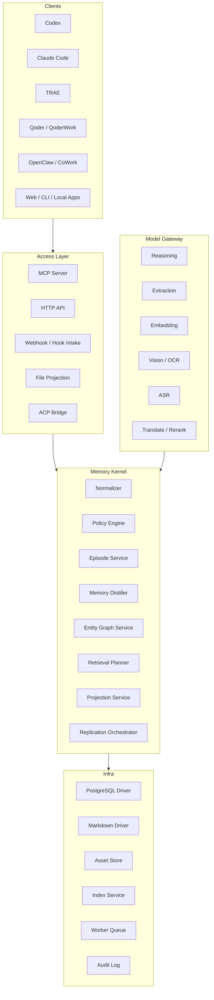

# Meat Memory Scheme V2

状态：Draft V2

更新时间：2026-04-01

目标语言：Rust

目标开发环境：macOS

相关文档：

- `docs/meat-memory-scheme-v1.md`

## 1. 文档定位

`Meat Memory Scheme V2` 是在 `V1` 基础上的细化版设计文档。

`V1` 解决的是“这个系统应该长什么样”的问题；`V2` 解决的是“这个系统如何真正开工实现”的问题。

因此，`V2` 的定位是：

- 作为架构评审稿
- 作为 Rust workspace 的拆分基线
- 作为数据库、文件规范、协议层和后台任务的统一设计源
- 作为后续编写 `domain model`、`postgres schema`、`mcp tools` 细化文档的总纲

本文档不直接给出最终 DDL 或完整 API schema，但会将关键对象、流程、模块边界和工程约束定义到足以落任务的粒度。

## 2. 设计目标

`Meat Memory` 是一个长期 Memory 内核。它不是某家 Agent 的插件，不是某个大模型的附庸，也不是单一向量库的包装器。

系统要解决的问题是：

- 将来自不同 Agent、模型、用户、团队、媒体类型和运行环境的上下文，统一沉淀为可检索、可治理、可复制、可投影的长期 Memory
- 让个人、本地项目、团队和组织都可以围绕同一套 Memory 内核工作
- 让 Memory 既能给机器读取，也能给人类审阅和修改
- 在云端、本地和混合部署中保持同一逻辑语义

## 3. V2 要回答的关键问题

V2 重点回答以下问题：

- 核心对象的字段和生命周期应该如何定义
- Memory 写入、蒸馏、检索、发布、同步的标准时序是什么
- PostgreSQL、Markdown、Asset Store 分别负责什么，边界在哪里
- 本地节点和云端节点如何复制、冲突如何处理
- 多团队、多项目、多用户的 Scope 如何组织
- 各类 Agent 和各模型厂商通过什么边界接入
- Rust 中应该拆哪些 crate、每个 crate 的依赖边界是什么
- V1 到 V2 的实施顺序与裁剪原则是什么

## 4. 设计摘要

V2 的设计摘要如下：

- 统一事实模型由 `Artifact`、`Episode`、`Memory`、`Entity`、`Relation`、`Evidence`、`Scope`、`Policy`、`Projection`、`OplogEntry` 构成
- 核心内核 `Memory Kernel` 负责归一化、策略、蒸馏、检索、同步编排和投影
- 存储采用双驱动：`PostgreSQL Driver` 与 `Markdown Driver`
- 所有非文本原始数据存储到 `Asset Store`
- 检索采用五段式：`query understanding -> lexical retrieval -> semantic retrieval -> graph expansion -> rerank`
- 同步采用 `object-level oplog + version vector + merge policy`
- Agent 接入优先级：`MCP -> HTTP API -> File Projection -> ACP bridge`
- 模型接入采用 `Model Gateway`，拆分为推理、抽取、Embedding、视觉、语音、翻译、重排等不同能力
- 系统默认是多 Scope、多语言、多模态、多租户可扩展的

## 5. 总体边界

### 5.1 系统内

系统内职责包括：

- 统一对象模型
- 统一 ID 和版本体系
- Artifact 归一化
- Episode 管理
- 长期 Memory 蒸馏
- 多模态转文本编排
- 实体抽取与关系抽取
- Scope、权限和敏感级治理
- PostgreSQL 与 Markdown 双后端读写
- 全文、向量、图谱检索
- 本地与云端同步
- Agent 适配、投影与上下文输出

### 5.2 系统外

系统外部依赖包括：

- PostgreSQL
- 本地文件系统或对象存储
- FFmpeg
- OCR、ASR、VLM、Embedding、聊天模型等外部模型能力
- 具体 Agent 客户端

### 5.3 不做的事情

V2 仍不把以下内容作为本系统核心：

- 自研数据库引擎
- 自研 ANN 索引引擎
- 自研媒体编码解码器
- 自研大模型
- 自研企业 IAM 平台

## 6. 核心架构



## 7. 设计原则

### 7.1 原始证据不可丢

所有长期 Memory 都必须有证据来源，证据至少能回溯到一个 Artifact。任何摘要、偏好、决策、关系边都不能脱离证据存在。

### 7.2 对象模型先于存储模型

领域对象必须独立于 PostgreSQL 行结构和 Markdown 文件结构。存储是 projection，不是事实本身。

### 7.3 Scope 是一等公民

每个对象都带 Scope。Scope 决定隔离、检索顺序、发布路径和同步策略。

### 7.4 多存储语义一致

无论写入 PG 还是 Markdown，逻辑上都应表示同一对象，不能出现“一个对象在两个存储里语义不同”的情况。

### 7.5 检索是计划，不是单次查询

检索不是一次向量搜索，而是一套查询计划。它会根据任务类型、Scope、语言、模态和预算动态选路。

### 7.6 模型只是插件

系统允许替换聊天模型、Embedding 模型、OCR、ASR、翻译和重排模型，而不影响核心对象模型。

### 7.7 人类可读优先于纯机器格式

Markdown 输出必须始终可读、可审查、可手改、可投影，避免成为“只是一个 dump”。

## 8. 术语表

### 8.1 Artifact

最原始的输入单位，任何消息、文件、终端输出、图片、音频、视频、网页快照都先进入 Artifact。

### 8.2 Episode

同一任务或连续会话的聚合单位，是短期上下文容器。

### 8.3 Memory

从 Artifact 和 Episode 中蒸馏出的长期知识对象。

### 8.4 Entity

系统中可被指代、归一和建立关系的对象，例如人、项目、仓库、服务、文档、任务、代码符号。

### 8.5 Relation

实体间或实体与 Memory 间的关系边。

### 8.6 Evidence

支持某条 Memory 或 Relation 的证据链。

### 8.7 Projection

将统一对象模型投影为某种外部表示的过程和产物，例如 Markdown、`AGENTS.md`、MCP 输出。

### 8.8 Scope

逻辑隔离和检索路由单位，可映射到组织、团队、项目、用户和会话。

### 8.9 Oplog

描述对象级变更的追加型日志，用于复制、恢复、审计和冲突合并。

## 9. 核心对象模型

本节定义 V2 的 canonical object model。该模型不直接等同于数据库表，而是内核使用的统一对象。

### 9.1 通用字段

所有核心对象建议具备以下基础字段：

- `id`
- `tenant_id`
- `scope_id`
- `created_at`
- `updated_at`
- `created_by`
- `updated_by`
- `status`
- `version`
- `visibility`
- `sensitivity`
- `labels`
- `source_refs`

其中：

- `status` 用于对象生命周期管理
- `version` 用于乐观锁和投影对齐
- `visibility` 用于查询可见范围
- `sensitivity` 用于同步和脱敏策略
- `labels` 用于轻量标签检索

### 9.2 ID 策略

V2 建议所有主对象使用全局唯一的稳定 ID。ID 规则如下：

- 对象级 ID 使用 `ULID` 或时间有序 UUID
- Markdown 文件名尽量包含对象 ID
- 资产内容使用 `sha256`
- 外部系统来源另存 `external_id`

推荐前缀：

- `art_`
- `epi_`
- `mem_`
- `ent_`
- `rel_`
- `pol_`
- `op_`
- `asset_`

### 9.3 Artifact

Artifact 是输入归一化后的事实载体。

#### 9.3.1 Artifact 子类型

- `message`
- `document`
- `code_diff`
- `code_file_snapshot`
- `terminal_output`
- `web_page`
- `image`
- `audio`
- `video`
- `meeting_transcript`
- `tool_result`
- `system_event`

#### 9.3.2 Artifact 关键字段

- `artifact_id`
- `artifact_kind`
- `mime_type`
- `language_code`
- `content_text`
- `structured_payload`
- `asset_ref`
- `content_hash`
- `source_system`
- `source_actor`
- `source_channel`
- `source_timestamp`
- `episode_id`
- `retention_policy`

#### 9.3.3 Artifact 不变量

- 原始内容必须可追溯
- 任何派生内容不得覆盖原始内容
- 多模态内容应允许同时存在原始资产与派生文本
- 同一原始内容重复写入时应可根据 `content_hash` 做幂等去重

### 9.4 Episode

Episode 表示一次任务或上下文切片。

#### 9.4.1 Episode 类型

- `chat_session`
- `coding_task`
- `meeting`
- `research_run`
- `automation_run`
- `workflow_run`
- `incident`

#### 9.4.2 Episode 关键字段

- `episode_id`
- `title`
- `episode_kind`
- `summary`
- `owner_principal_id`
- `participants`
- `started_at`
- `ended_at`
- `state`
- `parent_episode_id`
- `trigger_ref`

#### 9.4.3 Episode 生命周期

- `open`
- `idle`
- `closed`
- `archived`

规则：

- `open` Episode 可接收新 Artifact
- `closed` Episode 不再接收普通写入，但允许补充索引和投影
- `archived` Episode 仅用于查询与审计

### 9.5 Memory

Memory 是系统最重要的长期对象。

#### 9.5.1 Memory 类型

- `fact`
- `preference`
- `decision`
- `procedure`
- `constraint`
- `risk`
- `profile`
- `summary`
- `insight`
- `glossary`
- `todo_hint`

#### 9.5.2 Memory 关键字段

- `memory_id`
- `memory_kind`
- `title`
- `body`
- `canonical_statement`
- `confidence`
- `freshness_score`
- `importance_score`
- `stability_score`
- `evidence_count`
- `owner_scope_id`
- `published_from_scope_id`
- `supersedes_memory_id`
- `expires_at`

#### 9.5.3 Memory 生命周期

- `candidate`
- `active`
- `deprecated`
- `conflicted`
- `archived`
- `deleted`

规则：

- `candidate` 表示刚从流程中提取出的候选长期记忆
- `active` 表示可被正常检索与投影
- `deprecated` 表示内容被新记忆替代
- `conflicted` 表示存在跨源冲突，需人工或策略解决

#### 9.5.4 Memory 评分

建议至少维护四个评分：

- `confidence_score`：抽取或写入可信度
- `importance_score`：对当前 Scope 的长期价值
- `stability_score`：内容是否容易过时
- `freshness_score`：时间新鲜度

这些分数不直接暴露为业务意义，而用于检索和同步策略。

### 9.6 Entity

Entity 是知识图谱和上下文聚合的基本单位。

#### 9.6.1 Entity 类型

- `person`
- `team`
- `organization`
- `workspace`
- `project`
- `repository`
- `service`
- `document`
- `task`
- `meeting`
- `topic`
- `code_symbol`
- `asset`
- `location`
- `vendor`

#### 9.6.2 Entity 关键字段

- `entity_id`
- `entity_type`
- `canonical_name`
- `display_name`
- `description`
- `aliases`
- `external_refs`
- `owner_scope_id`
- `normalized_key`
- `state`

#### 9.6.3 Entity 归一规则

- 同一 Scope 下优先按 `normalized_key` 合并
- 跨 Scope 同名实体不自动合并
- 合并必须保留 alias、来源和证据集合
- 任何自动合并都必须能回滚

### 9.7 Relation

Relation 用于表达实体之间的结构化联系。

#### 9.7.1 Relation 类型

- `member_of`
- `belongs_to`
- `owns`
- `depends_on`
- `uses`
- `implements`
- `references`
- `mentions`
- `derived_from`
- `blocks`
- `causes`
- `decides`
- `documented_in`
- `generated_by`

#### 9.7.2 Relation 字段

- `relation_id`
- `relation_type`
- `subject_entity_id`
- `object_entity_id`
- `direction`
- `weight`
- `confidence`
- `state`
- `valid_from`
- `valid_to`

#### 9.7.3 Relation 不变量

- 每条 relation 至少关联一条 evidence
- 关系类型必须有限枚举，V2 不做开放式 ontology
- 低置信度关系应停留在候选态，不进入主检索路径

### 9.8 Evidence

Evidence 用于绑定支持某条 Memory 或 Relation 的原始依据。

#### 9.8.1 Evidence 字段

- `evidence_id`
- `target_kind`
- `target_id`
- `artifact_id`
- `span_ref`
- `quote_text`
- `source_confidence`
- `derived_by`
- `created_at`

#### 9.8.2 Evidence 设计说明

- `span_ref` 用于标记文本或时间轴范围
- 图片、音频、视频可通过 frame/time span 建立 evidence
- `quote_text` 仅保留短摘录，不能替代原始内容

### 9.9 Scope

Scope 决定访问边界、检索优先级和发布路径。

#### 9.9.1 Scope 层级

- `org`
- `team`
- `workspace`
- `project`
- `user`
- `session`

#### 9.9.2 Scope 字段

- `scope_id`
- `scope_type`
- `parent_scope_id`
- `path`
- `owner_principal_id`
- `inherit_policy`
- `default_visibility`
- `sync_policy`

#### 9.9.3 Scope 规则

- 父子 Scope 形成树，但检索时可以叠层，不要求物理数据上推
- 用户 Memory 默认写入 `user` 或 `project` Scope
- 团队共享必须通过 publish 或 promotion 流程

### 9.10 Policy

Policy 是治理层的显式对象。

#### 9.10.1 Policy 类型

- `retention_policy`
- `redaction_policy`
- `sync_policy`
- `publish_policy`
- `visibility_policy`
- `projection_policy`

#### 9.10.2 Policy 字段

- `policy_id`
- `policy_type`
- `applies_to_scope_id`
- `ruleset`
- `version`
- `enabled`

### 9.11 Projection

Projection 表示统一对象向外部形态的映射。

#### 9.11.1 Projection 类型

- `markdown_memory`
- `agents_context`
- `mcp_context_bundle`
- `http_context_bundle`
- `team_digest`
- `local_sidecar`

#### 9.11.2 Projection 字段

- `projection_id`
- `projection_type`
- `target_scope_id`
- `profile`
- `rendered_hash`
- `rendered_at`
- `destination_ref`

### 9.12 OplogEntry

OplogEntry 是同步、恢复和审计的基石。

#### 9.12.1 Oplog 类型

- `create_object`
- `update_object`
- `delete_object`
- `attach_evidence`
- `publish_memory`
- `merge_entity`
- `split_entity`
- `render_projection`
- `sync_ack`

#### 9.12.2 Oplog 字段

- `op_id`
- `op_type`
- `object_kind`
- `object_id`
- `source_node_id`
- `actor_id`
- `base_version`
- `next_version`
- `payload`
- `created_at`

## 10. 生命周期与状态机

### 10.1 对象状态原则

所有对象状态变化都应显式化，禁止“靠字段是否为空推断状态”。

### 10.2 Artifact 状态

- `ingested`
- `processed`
- `indexed`
- `archived`
- `failed`

### 10.3 Memory 状态

- `candidate`
- `active`
- `deprecated`
- `conflicted`
- `archived`
- `deleted`

### 10.4 Relation 状态

- `candidate`
- `active`
- `rejected`
- `archived`

### 10.5 Projection 状态

- `pending`
- `rendered`
- `stale`
- `failed`

### 10.6 Sync 状态

- `queued`
- `inflight`
- `acked`
- `retrying`
- `dead_letter`

## 11. 写入链路设计

本节定义 V2 中最关键的写入链路。

### 11.1 文本记忆写入

标准路径：

1. 客户端调用 `memory.remember` 或 HTTP `POST /memories`
2. Access Layer 校验身份和 Scope
3. Normalizer 将输入转换为 `Artifact`
4. Episode Service 绑定或创建 Episode
5. Policy Engine 判断敏感级、可见性、是否允许长期化
6. Distiller 提取 candidate memory
7. Evidence Service 将 Memory 与 Artifact 绑定
8. Store Layer 写入对象
9. Index Service 异步更新全文、向量和图谱索引
10. Projection Service 更新对应 Markdown 和 Agent 上下文文件

### 11.2 多模态写入

标准路径：

1. 接收媒体文件元信息
2. 原始文件写入 Asset Store
3. 创建基础 Artifact
4. 投递后台任务
5. Worker 执行 OCR、ASR、关键帧、场景切分、视觉摘要
6. 生成派生 Artifact
7. Distiller 与 Graph Pipeline 运行
8. 更新索引与 Projection

### 11.3 自动写入

自动写入适用于：

- Agent 任务结束总结
- 代码变更总结
- 会议结束纪要
- 文件扫描导入
- Webhook 事件采集

规则：

- 自动写入默认先进入 `candidate`
- 高敏感信息进入 `candidate + restricted`
- 团队共享必须走 publish 流程

### 11.4 幂等与去重

系统必须防止同一内容在自动化场景中被无限重复写入。

幂等策略建议：

- `content_hash + scope + artifact_kind`
- 可选外部 `idempotency_key`
- 同一 Episode 内短时间重复写入进行压缩

### 11.5 失败处理

写入失败要按阶段拆分：

- 鉴权失败
- 归一化失败
- 资产存储失败
- 模型处理失败
- 主存储事务失败
- 索引构建失败
- Projection 失败

原则：

- 核心对象写入成功后，索引和 Projection 失败不回滚主对象
- 失败步骤必须可重试
- 失败信息记录到审计和任务日志

## 12. 检索链路设计

检索不是单次数据库查询，而是一条动态规划的链路。

### 12.1 输入

检索输入至少包括：

- 查询文本
- 当前 Agent 类型
- 当前 Scope
- 任务类型
- 可接受上下文大小
- 语言偏好
- 模态偏好

### 12.2 Query Understanding

Query Understanding 负责判断：

- 这是事实查询、偏好查询、决策查询还是流程查询
- 优先搜哪个 Scope
- 是否需要时间过滤
- 是否需要图谱扩展
- 是否需要多语言扩展
- 是否需要媒体检索

### 12.3 Candidate Retrieval

候选召回分为三路并行：

- 词法召回
- 语义召回
- 图谱扩展召回

如任务类型涉及代码或项目语境，可额外增加：

- `project-local preference boost`
- `code symbol entity expansion`

### 12.4 Rerank

Rerank 输入因素包括：

- Scope 权重
- 时间新鲜度
- 重要度
- 稳定度
- 证据数量
- Memory 类型匹配度
- 当前 Agent 使用场景
- 语言匹配度

### 12.5 Context Bundle

最终不是简单返回文档列表，而是输出结构化 `ContextBundle`：

- `task_summary`
- `top_memories`
- `related_entities`
- `key_decisions`
- `constraints`
- `warnings`
- `evidence_refs`
- `projection_hints`

### 12.6 Token Budget

Memory 系统必须有预算意识。

建议支持三种预算：

- `tiny`
- `standard`
- `large`

策略：

- `tiny` 仅返回最关键决策、约束和偏好
- `standard` 返回决策、事实、流程、相关实体
- `large` 允许包含更多证据和历史上下文

## 13. 发布与共享流程

个人和团队的边界不能靠“默认都共享”实现。

### 13.1 Publish 流程

标准流程：

1. 用户或自动规则发起 publish
2. Policy Engine 检查敏感级
3. 生成目标 Scope 的 candidate memory
4. 保留 `published_from_scope_id`
5. 通过审查或自动规则后转为 `active`

### 13.2 Promotion 流程

支持：

- `user -> project`
- `project -> team`
- `team -> org`

### 13.3 Merge 与 Overlay

两者含义不同：

- `overlay`：查询期叠层，不改变对象归属
- `merge`：对象级合并，需要新版本和审计轨迹

## 14. 存储设计

### 14.1 PostgreSQL 角色

PostgreSQL 负责：

- 主业务事务
- 结构化对象存储
- Scope 与权限
- 审计日志
- 图谱关系
- 同步元数据
- 全文索引入口

### 14.2 Markdown 角色

Markdown 负责：

- 人可读的长期内容
- Agent 规则和上下文文件
- 可离线携带的本地事实副本
- Git 友好的历史演进

### 14.3 Asset Store 角色

Asset Store 负责：

- 图片、音频、视频、附件等二进制文件
- 大文件内容寻址
- 派生资产版本关联

### 14.4 写入顺序

推荐写入顺序：

1. 先写入 PostgreSQL 主对象事务
2. 记录 oplog
3. 异步写入 Markdown projection
4. 异步更新 index
5. 异步生成 agent projections

在 `MdPrimary` 模式下可反转顺序，但仍建议先产出 canonical object，再投影为 Markdown。

## 15. PostgreSQL 逻辑表族

V2 按“表族”而非单表来组织设计。

### 15.1 组织与身份表族

- `tenants`
- `scopes`
- `principals`
- `principal_scope_memberships`

### 15.2 内容主表族

- `episodes`
- `artifacts`
- `artifact_parts`
- `memories`
- `memory_versions`

### 15.3 图谱表族

- `entities`
- `entity_aliases`
- `relations`
- `relation_evidence_links`

### 15.4 证据与引用表族

- `memory_evidence_links`
- `artifact_entity_links`
- `artifact_relation_candidates`

### 15.5 投影表族

- `projections`
- `projection_targets`
- `projection_runs`

### 15.6 同步表族

- `oplog_entries`
- `replication_peers`
- `replication_cursors`
- `replication_batches`
- `dead_letters`

### 15.7 治理表族

- `policies`
- `audit_logs`
- `access_logs`

## 16. Markdown 设计

Markdown 不是简单的导出，而是“第二事实载体”与“生态接入面”。

### 16.1 目录规范

```text
docs/
  tenants/
    {tenant}/
      scopes/
        {scope}/
          MEMORY.md
          DECISIONS.md
          PREFERENCES.md
          CONSTRAINTS.md
      episodes/
        YYYY/
          MM/
            DD/
              {episode_id}.md
      entities/
        {entity_id}-{slug}.md
      relations/
        {relation_id}.md
      projections/
        agents/
          AGENTS.md
        codex/
          context.md
        claude-code/
          context.md
        qoder/
          context.md
        openclaw/
          context.md
      assets/
        sha256/
          {sha256}.{ext}
```

### 16.2 文档类型

建议 Markdown 文档分为：

- `scope rollup docs`
- `episode docs`
- `entity docs`
- `relation docs`
- `agent projections`

### 16.3 Frontmatter 规范

建议至少包含：

- `id`
- `kind`
- `tenant`
- `scope`
- `status`
- `visibility`
- `sensitivity`
- `created_at`
- `updated_at`
- `source_refs`
- `evidence`
- `entities`
- `tags`

### 16.4 文件命名规则

- 文件名始终包含主对象 ID
- 可读 slug 只作为辅助，不作为主键
- Scope 下的聚合文档采用稳定固定文件名

### 16.5 Markdown 合并原则

- 文件层冲突不直接文本 merge
- 应先恢复到对象层，再重新 render
- Markdown 手工编辑只能修改允许编辑的片段

### 16.6 手工编辑策略

V2 建议支持“受控手改”：

- 正文中的特定段落允许用户编辑
- Frontmatter 中的系统字段不建议手改
- 用户手改需写回为新版本而不是覆盖原对象历史

## 17. Asset Store 设计

### 17.1 资产分类

- `raw`
- `derived`
- `thumbnail`
- `transcript`
- `ocr_json`
- `waveform`
- `keyframes`

### 17.2 内容寻址

所有资产建议使用内容哈希作为主寻址键。

### 17.3 本地与云端

支持：

- 本地目录模式
- S3 兼容对象存储模式
- 混合模式下本地缓存 + 云端归档

### 17.4 资产元数据

建议维护：

- `asset_id`
- `sha256`
- `size_bytes`
- `mime_type`
- `duration_ms`
- `width`
- `height`
- `page_count`
- `codec`
- `storage_class`

## 18. 索引架构

### 18.1 索引类型

系统至少有四类索引：

- 全文索引
- 语义向量索引
- 图谱邻接索引
- 时间与标签过滤索引

### 18.2 全文索引

全文索引负责：

- 精准术语
- 标题
- 标签
- 文件名
- 代码符号
- 时间过滤配合

### 18.3 语义索引

语义索引负责：

- 自然语言相似问题召回
- 跨语言表达匹配
- 图片或媒体派生文本召回

### 18.4 图谱索引

图谱索引负责：

- 找到相关人员、项目、服务、文档
- 沿关系图扩展上下文
- 发现关联决策和依赖

### 18.5 索引更新策略

更新分为：

- 同步更新：必要最小元数据
- 异步更新：向量、图谱和大文档全文

### 18.6 Rebuild 策略

必须支持：

- 单对象重建
- 单 Scope 重建
- 全量重建
- 基于 oplog 的增量重建

## 19. 同步与复制设计

同步设计是本项目最容易做歪的一层，因此必须尽早定义。

### 19.1 同步对象

同步的不是 Markdown 文件，而是对象级变更：

- object create
- object update
- evidence attach
- publish
- merge
- projection invalidation

### 19.2 节点类型

支持以下节点角色：

- `local personal node`
- `shared team node`
- `cloud central node`
- `edge cache node`

### 19.3 同步方向

支持：

- `push`
- `pull`
- `bidirectional`

### 19.4 Version Vector

V2 建议使用 `version vector` 或等价机制追踪节点间变更进度。

每个对象至少需要：

- `base_version`
- `current_version`
- `last_writer_node_id`

### 19.5 冲突分类

冲突至少分为：

- 内容冲突
- Scope 冲突
- 发布冲突
- 删除与更新冲突
- Entity 自动合并冲突

### 19.6 冲突处理原则

- 不静默覆盖
- 保留来源
- 能自动 merge 的只 merge 非结构冲突
- 无法自动处理的转 `conflicted`

### 19.7 Tombstone

删除不能立即物理移除，应通过 tombstone 保留同步和审计一致性。

### 19.8 Retry 与死信

同步失败必须进入：

- 重试队列
- 指数退避
- 超限进入 dead letter

## 20. 多模态流水线

### 20.1 图片流水线

1. 保存原图
2. 生成基础元数据
3. OCR
4. 视觉摘要
5. 生成 embedding
6. 绑定实体和证据

### 20.2 音频流水线

1. 保存原始音频
2. 转录
3. 说话人分离
4. 时间轴切片
5. 摘要、行动项和实体抽取
6. 写入派生 Artifact

### 20.3 视频流水线

1. 保存视频
2. 提取关键帧
3. 场景切分
4. OCR + ASR
5. 视频摘要
6. clip 级索引
7. 派生 Artifact 写入

### 20.4 媒体统一输出

所有媒体最终都应归一为：

- 原始资产
- 结构化元数据
- 派生文本
- 可检索向量
- 可引用证据

## 21. 知识图谱设计

### 21.1 图谱目标

图谱不是单独的产品层，而是检索增强层。

### 21.2 图谱构建路径

1. 从 Artifact 和 Memory 中抽取实体
2. 做归一与别名聚合
3. 构建候选关系
4. 绑定证据
5. 通过阈值与规则升级为 active relation

### 21.3 图谱查询类型

- 给定项目，找相关人员和服务
- 给定人，找关联会议、文档、决策
- 给定服务，找依赖、风险、负责人
- 给定术语，找文档、项目和历史决策

### 21.4 图谱限制

- 不做任意开放 schema
- 不做复杂本体编辑器
- 不做脱离证据的自动推断链

## 22. 多语言设计

### 22.1 原则

- 原文保留
- 语言显式标记
- 检索可跨语言
- 输出语言与证据语言可不同

### 22.2 处理流程

1. 写入时语言检测
2. 必要时生成标准化摘要
3. 生成 aliases 和 translation refs
4. 索引时保留原文与跨语言入口

### 22.3 多语言检索

检索建议三路并行：

- 原文检索
- 翻译摘要检索
- 多语言 embedding 检索

### 22.4 输出策略

- Agent 请求中文时，ContextBundle 可输出中文摘要
- 证据仍引用原文
- 原文与翻译之间使用 `translation_ref` 绑定

## 23. Agent 接入架构

### 23.1 首选协议

首选顺序：

1. `MCP`
2. `HTTP API`
3. `File Projection`
4. `ACP Bridge`

### 23.2 Coding Agent 场景

适用于：

- Codex
- Claude Code
- TRAE
- Qoder
- QoderWork

重点能力：

- 当前项目相关上下文
- 代码风格偏好
- 约束与决定
- 历史修复经验
- 项目实体与服务关系

### 23.3 Agent Workspace 场景

适用于：

- OpenClaw
- CoWork
- 自动化工作流 Agent

重点能力：

- 长期用户偏好
- 团队共享知识
- 会话摘要
- 跨工具引用的持久上下文

### 23.4 File Projection 场景

适用于：

- 只认 Markdown 规则文件的 Agent
- 本地开发环境
- Git 版本审查

## 24. MCP 工具面建议

V2 的 MCP 工具建议明确分层。

### 24.1 写入类

- `memory.remember`
- `memory.remember_media`
- `memory.publish`
- `memory.pin`

### 24.2 检索类

- `memory.search`
- `memory.fetch_context`
- `memory.get_memory`
- `memory.get_entity`

### 24.3 图谱类

- `memory.link_entities`
- `memory.list_relations`
- `memory.resolve_entity`

### 24.4 投影类

- `memory.export_projection`
- `memory.invalidate_projection`

### 24.5 管理类

- `memory.list_scopes`
- `memory.get_policy`
- `memory.get_sync_status`

## 25. HTTP API 设计建议

### 25.1 API 风格

建议采用资源化 HTTP API，配合 SSE 或 WebSocket 提供异步任务状态。

### 25.2 核心资源

- `/artifacts`
- `/episodes`
- `/memories`
- `/entities`
- `/relations`
- `/projections`
- `/sync`
- `/policies`

### 25.3 异步任务

以下操作建议返回 job id：

- 大文件媒体写入
- 全量 projection 重建
- 索引重建
- 大规模同步

### 25.4 返回规范

建议统一返回：

- `data`
- `meta`
- `warnings`
- `trace_id`

## 26. Model Gateway 设计

### 26.1 能力拆分

不要把所有模型都抽象成同一个聊天接口。

建议区分：

- `ReasoningModel`
- `ExtractionModel`
- `EmbeddingModel`
- `VisionModel`
- `SpeechToTextModel`
- `TranslateModel`
- `RerankModel`

### 26.2 选择策略

模型选择应由策略决定，而不是写死：

- 低成本批处理
- 高精度抽取
- 低延迟在线召回
- 私有部署优先
- 区域合规优先

### 26.3 回退机制

每类能力都应支持：

- 主模型
- 备模型
- 失败回退
- 降级策略

### 26.4 Embedding 规范

V2 建议：

- 文本使用一套主 embedding 空间
- 图像、音频、视频等多模态可独立空间
- 跨空间只能通过 late fusion，不做相似度混算

## 27. Rust workspace 设计

### 27.1 推荐目录

```text
meat-memory/
  Cargo.toml
  rust-toolchain.toml
  crates/
    memory-core/
    memory-domain/
    memory-store/
    memory-store-pg/
    memory-store-md/
    memory-assets/
    memory-index/
    memory-sync/
    memory-policy/
    memory-extract/
    memory-models/
    memory-mcp/
    memory-http/
    memory-worker/
    memory-cli/
    memory-config/
    memory-observability/
    memory-app/
```

### 27.2 crate 职责

- `memory-core`：领域服务接口与通用 error
- `memory-domain`：对象定义、枚举、值对象、状态机
- `memory-store`：repository traits
- `memory-store-pg`：SQLx 驱动实现
- `memory-store-md`：Markdown 读写、frontmatter 解析与 render
- `memory-assets`：资产寻址和存储后端
- `memory-index`：索引接口和查询计划
- `memory-sync`：oplog、复制和冲突处理
- `memory-policy`：可见性、脱敏、发布规则
- `memory-extract`：蒸馏、摘要、实体/关系抽取、多模态派生
- `memory-models`：多模型 adapter
- `memory-mcp`：MCP transport 和 tool handlers
- `memory-http`：HTTP routes
- `memory-worker`：后台 job executor
- `memory-cli`：本地命令行
- `memory-config`：配置加载
- `memory-observability`：日志、metrics、trace
- `memory-app`：主二进制入口

### 27.3 crate 依赖原则

- `memory-domain` 不依赖具体存储和外部模型
- `memory-core` 依赖 `memory-domain` 和 trait 层
- `memory-store-pg`、`memory-store-md` 依赖 `memory-store`
- `memory-mcp`、`memory-http` 只依赖服务层，不直接接数据库
- `memory-worker` 不直接实现业务规则，只编排服务调用

## 28. 关键 Rust Trait

### 28.1 Repository Trait

```rust
pub trait ArtifactRepository {
    async fn put(&self, artifact: Artifact) -> Result<Artifact>;
    async fn get(&self, id: ArtifactId) -> Result<Option<Artifact>>;
    async fn list_by_episode(&self, episode_id: EpisodeId) -> Result<Vec<Artifact>>;
}
```

```rust
pub trait MemoryRepository {
    async fn put(&self, memory: Memory) -> Result<Memory>;
    async fn get(&self, id: MemoryId) -> Result<Option<Memory>>;
    async fn search(&self, query: SearchQuery) -> Result<SearchCandidates>;
}
```

### 28.2 Service Trait

```rust
pub trait MemoryService {
    async fn remember(&self, input: RememberInput) -> Result<RememberOutput>;
    async fn fetch_context(&self, input: FetchContextInput) -> Result<ContextBundle>;
    async fn publish(&self, input: PublishInput) -> Result<PublishOutput>;
}
```

### 28.3 Model Trait

```rust
pub trait EmbeddingModel {
    async fn embed_texts(&self, texts: &[String]) -> Result<Vec<Vec<f32>>>;
}
```

```rust
pub trait ExtractionModel {
    async fn extract_memories(&self, input: ExtractionInput) -> Result<ExtractionOutput>;
    async fn extract_entities(&self, input: EntityExtractionInput) -> Result<EntityExtractionOutput>;
}
```

### 28.4 Sync Trait

```rust
pub trait ReplicationEngine {
    async fn append(&self, entry: OplogEntry) -> Result<()>;
    async fn pull(&self, cursor: SyncCursor) -> Result<SyncBatch>;
    async fn apply(&self, batch: SyncBatch) -> Result<ApplyBatchResult>;
}
```

## 29. 配置设计

### 29.1 配置来源

建议支持：

- `application.toml`
- 环境变量
- 本地 profile 覆盖
- 命令行覆盖

### 29.2 配置域

- `server`
- `postgres`
- `assets`
- `markdown`
- `models`
- `sync`
- `projection`
- `observability`
- `security`

### 29.3 示例配置域

```toml
[server]
bind = "127.0.0.1:8080"

[markdown]
root = "./docs"

[sync]
mode = "dual_write"

[models.embedding]
provider = "qwen"
```

## 30. macOS 开发环境建议

### 30.1 本地开发分层

建议在 macOS 上采用：

- Rust 原生运行
- PostgreSQL 独立运行
- 资产目录使用本地文件系统
- Worker 与 app 可先同进程，后续再拆

### 30.2 本地工具

建议准备：

- Rust stable toolchain
- `sqlx-cli`
- PostgreSQL
- `ffmpeg`
- `just` 或 `make`
- `cargo-nextest`

### 30.3 调试建议

- HTTP 服务走本机调试
- 数据库本机或容器
- 媒体测试样本单独目录管理
- Projection 输出直接落到仓库 `docs/` 下方便审阅

## 31. 可观测性设计

### 31.1 日志

所有请求和后台任务都应带：

- `trace_id`
- `scope_id`
- `principal_id`
- `episode_id`
- `object_ids`

### 31.2 Metrics

至少统计：

- 写入 QPS
- 检索延迟
- 模型调用延迟
- 同步积压
- Projection 失败数
- 索引重建时间

### 31.3 Tracing

重点链路需要 tracing：

- remember
- fetch_context
- media ingest
- publish
- sync apply

## 32. 安全与治理

### 32.1 身份与授权

V2 可从简，但必须显式设计：

- principal
- scope membership
- token 或本地凭据
- audit trail

### 32.2 敏感级

建议分级：

- `public`
- `internal`
- `team`
- `private`
- `restricted`

### 32.3 脱敏

支持：

- 写入前脱敏
- 同步前脱敏
- Projection 时脱敏

### 32.4 审计

必须记录：

- 谁写入了什么
- 谁读取了哪个 Scope
- 谁进行了 publish
- 哪次同步传播了哪些对象

## 33. 测试策略

### 33.1 单元测试

覆盖：

- 状态机
- ID 规则
- Scope 判定
- Policy 规则
- Markdown render

### 33.2 集成测试

覆盖：

- PG 写入与查询
- Markdown projection
- Oplog 复制
- Context retrieval

### 33.3 端到端测试

覆盖：

- Agent remember -> retrieve -> publish
- 本地写入 -> 云端同步
- 媒体导入 -> 派生文本 -> 图谱更新

### 33.4 回归测试

使用固定样本集验证：

- 检索质量
- 图谱稳定性
- Projection 可读性

## 34. 实施顺序

### 34.1 Phase A：骨架

目标是建立统一对象模型和最小服务。

- `memory-domain`
- `memory-core`
- `memory-store`
- `memory-cli`
- 基础配置与日志

### 34.2 Phase B：双存储主链路

- `memory-store-pg`
- `memory-store-md`
- `memory-assets`
- `remember`
- `fetch_context`

### 34.3 Phase C：MCP 与投影

- `memory-mcp`
- `AGENTS.md` projection
- Scope rollup docs
- 基础 agent context bundle

### 34.4 Phase D：索引与图谱

- 词法索引
- embedding 索引
- entity / relation pipeline
- rerank

### 34.5 Phase E：同步与团队共享

- oplog
- replication
- publish
- promotion
- overlay retrieval

### 34.6 Phase F：多模态与多语言

- image
- audio
- video
- cross-language retrieval

## 35. 裁剪建议

如果资源有限，建议先裁剪以下内容：

- 暂缓视频深度分析
- 暂缓复杂组织级审批流
- 暂缓多 embedding 空间并存
- 暂缓 GUI 管理台
- 暂缓自动关系推理增强

但不要裁剪以下内容：

- 统一对象模型
- Scope 体系
- 证据链
- 双驱动抽象
- Oplog
- Projection 机制

## 36. 风险清单

### 36.1 过度耦合风险

如果让存储表结构、Markdown 文件结构和核心领域模型互相直接耦合，后续演进会非常痛苦。

### 36.2 厂商锁定风险

如果把某个模型厂商的 JSON 输出当 canonical schema，会导致迁移困难。

### 36.3 同步复杂度风险

如果没有从 V2 就定义 oplog 和冲突模型，后续混合部署会难以补救。

### 36.4 Projection 污染风险

如果把 Agent 专属投影反向污染核心对象模型，系统会逐渐碎裂成多个私有实现。

### 36.5 检索质量风险

如果只靠向量召回，不做 Scope、类型、证据和时间重排，长期 Memory 很快会失控。

## 37. V2 成功标准

当 V2 设计被认为足够细化时，应满足以下标准：

- 已能清晰拆出 Rust workspace 结构
- 已能定义数据库表族和对象字段
- 已能画出 remember、fetch_context、publish、sync 的标准时序
- 已能明确 PG、Markdown、Asset、Index、Oplog 的职责边界
- 已能指导实现本地版、云端版与混合版
- 已能为 Agent、模型和多模态扩展留出稳定接口

## 38. 下一步文档建议

在本 `V2` 基础上，建议继续拆出以下文档：

1. `docs/meat-memory-domain-model-v1.md`
2. `docs/meat-memory-postgres-schema-v1.md`
3. `docs/meat-memory-markdown-spec-v1.md`
4. `docs/meat-memory-sync-protocol-v1.md`
5. `docs/meat-memory-mcp-tools-v1.md`
6. `docs/meat-memory-rust-workspace-v1.md`

这些文档的关系如下：

- `scheme-v2` 负责总设计
- `domain-model` 固定对象与状态机
- `postgres-schema` 固定关系库结构
- `markdown-spec` 固定文件投影结构
- `sync-protocol` 固定复制协议
- `mcp-tools` 固定 Agent 接入面
- `rust-workspace` 固定 crate 拆分和依赖边界
