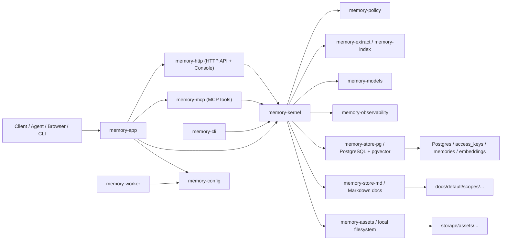
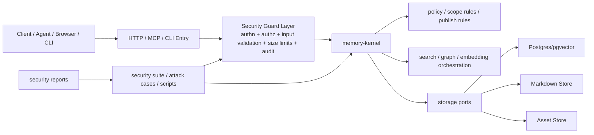

# Meat Memory V2.3 方案：安全与代码优化

更新时间：2026-04-11

## 1. 背景

`Meat Memory` 当前已经完成 V1、V2、V2.1、V2.2 的主体交付，系统具备：

- Rust workspace 工程化基础
- HTTP / CLI / MCP 多入口
- `memory-kernel` 核心编排层
- PostgreSQL + Markdown 双存储
- Access Key、隔离策略、混合检索与基础监控

从当前代码状态看，安全控制已经有基础，但仍存在以下问题：

- 安全逻辑分散在 `memory-http`、`memory-mcp`、`memory-kernel`
- 高价值入口未完全统一纳入鉴权与权限边界
- `tests/security/` 与 `tests/reports/security/latest/` 仍是占位
- 缺少“劫持 / 注入 / 越权 / 资源滥用”专项扫描链路
- 架构文档尚未沉淀当前实时安全边界与目标演进图

因此，V2.3 的定位不是单次修补，而是补齐“安全扫描 -> 报告 -> 修复 -> 回归 -> 持续执行”的完整能力。

## 2. 目标

V2.3 聚焦三个方向：

1. 全面扫描系统安全漏洞，并形成带严重级别的问题清单。
2. 对劫持、注入做专项扫描与回归测试。
3. 优化代码与安全边界，必要时做小幅架构收口，但不偏离当前技术方向。

## 3. 当前实时架构图

## 4. 当前架构判断

### 4.1 主链路

- `memory-app` 负责组装 HTTP、MCP、Kernel。
- `memory-kernel` 是业务核心，承载 remember/search/promote/key context。
- `memory-http`、`memory-mcp` 是外部入口层。
- `memory-store-pg`、`memory-store-md`、`memory-assets` 是存储边界。

### 4.2 主要安全边界

- 入口认证：HTTP Header / Bearer / MCP key 参数
- 作用域权限：scope、team/personal、isolation group
- 写入策略：visibility / sensitivity / publish policy
- 数据落盘：Postgres / Markdown / 文件资产
- 查询边界：browse/search/context/promote/key management

### 4.3 当前主要风险方向

- 高价值接口缺统一鉴权
- 提升/发布操作缺统一授权校验
- 浏览接口存在枚举风险
- HTTP 与 MCP 的鉴权策略不完全统一
- 输入大小、资源消耗和异常负载限制不足
- 安全测试与报告流程尚未接通

## 5. 目标架构图

## 6. 设计原则

- 不改变 Rust workspace + Axum + Kernel 分层主方向
- 先收拢安全边界，再做局部重构
- 先建立扫描与测试，再修复问题
- 修复必须可回归、可报告、可持续执行
- 架构调整只做“收口”，不做大规模推倒重来

### 6.1 安全职责分层

| 层级 | 职责 |
|---|---|
| Entry Layer (`memory-http` / `memory-mcp`) | 认证、请求入口校验、长度/大小限制、协议级错误返回 |
| Kernel (`memory-kernel`) | 授权、scope ownership、敏感操作审批、统一业务安全边界 |
| Policy (`memory-policy`) | visibility / sensitivity / publish 规则判定 |
| Store (`memory-store-pg` / `memory-store-md` / `memory-assets`) | 数据持久化、安全编码、路径与结构约束 |
| Tests / Reports | 注入、劫持、越权、资源滥用回归与报告产物 |

## 7. 扫描范围设计

### 7.1 全量安全扫描

覆盖以下面向：

- HTTP API
- MCP 工具调用
- CLI/本地操作入口
- Access Key 生命周期
- scope 权限与数据隔离
- PostgreSQL 查询与持久化
- Markdown projection 与本地文件落盘
- 图片/二进制资产存储
- 配置、环境变量、默认值与部署脚本

### 7.1.1 攻击面与信任边界清单

| 面向 | 入口/模块 | 关键资产 | 主要风险 |
|---|---|---|---|
| HTTP | `memory-http` | memory、access key、scope、asset | 匿名访问、越权、枚举、注入、异常 payload |
| MCP | `memory-mcp` | tool call、memory、scope | tool 参数伪造、key 缺失、publish/promote 越权 |
| CLI | `memory-cli` | 本地配置、默认 key、服务入口 | 本地误用、明文 key 处理、绕过服务边界 |
| Kernel | `memory-kernel` | RequestContext、policy、promotion | 鉴权逻辑分散、scope ownership 缺失、策略绕过 |
| PostgreSQL | `memory-store-pg` | access_keys、memories、embeddings | 越权查询、数据泄露、审计不足 |
| Markdown | `memory-store-md` | `docs/default/scopes/...` | 枚举、frontmatter 污染、跨 scope 写入 |
| Assets | `memory-assets` | `storage/assets/...` | 大文件滥用、扩展名注入、路径策略缺测试证明 |
| Config | `memory-config`/`config/app.toml` | bind、DB URL、feature flags、model route | 默认值过宽、require_key 未统一、部署暴露 |
| Deploy | `compose.yaml` / `Dockerfile` / Helm | 端口、卷、镜像环境变量 | 默认暴露、生产配置遗漏、密钥处理 |

### 7.1.2 安全检查矩阵

| 检查项 | HTTP | MCP | CLI | Kernel | Store | 状态 |
|---|---|---|---|---|---|---|
| 认证必需性 | 已纳入敏感接口 | 已纳入 publish/promote | 待补系统化检查 | 已接 RequestContext | N/A | 进行中 |
| scope 授权 | browse/promote 已收口 | publish/promote 已收口 | 待补 | 已新增 owner scope 校验 | N/A | 进行中 |
| 输入长度限制 | body/query/prompt/image 已加限制 | 待补 | 待补 | 依赖入口层 | N/A | 进行中 |
| 越权枚举控制 | explorer/assistant 已限制 | 待补 | N/A | 待补系统化接口 | list/filter 待持续加强 | 进行中 |
| 敏感操作审计 | 部分依赖 key usage | 部分依赖 key usage | 待补 | 已有 key usage record | PG 已存 usage event | 进行中 |
| 注入测试 | 已开始补回归 | 待补回归 | 待补 | 待补 | 待补 | 进行中 |
| 安全报告输出 | 已设计脚本 | 将并入脚本 | 将并入脚本 | 间接覆盖 | 间接覆盖 | 进行中 |

### 7.2 劫持专项扫描

重点验证：

- 伪造 Bearer / `x-meat-memory-key`
- 未鉴权访问高价值接口
- 冒用 scope / owner / key
- team key 读取 personal scope
- MCP 工具调用绕过 HTTP 策略
- promote / publish / browse / key rotate 越权

### 7.3 注入专项扫描

重点验证：

- SQL 注入
- Markdown / frontmatter 注入
- 路径穿越与文件写入注入
- header / 参数污染
- base64 异常负载
- prompt / tool arguments 污染
- limit / query / body 边界值注入

## 8. 初步风险清单

以下为基于当前代码静态审阅得出的首版问题清单，后续执行时将升级为正式安全报告。

| 编号 | 问题 | 严重级别 | 说明 |
|---|---|---|---|
| `V2.3-SEC-OBS-001` | 高价值接口缺统一鉴权 | High | key 管理、浏览、promote 等入口需统一认证策略 |
| `V2.3-SEC-OBS-002` | 提升/发布操作缺统一授权校验 | High | `publish/promote` 需绑定调用方 scope ownership |
| `V2.3-SEC-OBS-003` | 浏览接口存在枚举风险 | High | explorer/browse 不应默认暴露全量 memory |
| `V2.3-SEC-OBS-004` | HTTP 与 MCP 鉴权策略不完全一致 | Medium | 需统一 require-key、optional-key 与 audit 语义 |
| `V2.3-SEC-OBS-005` | 输入大小与资源消耗限制不足 | Medium | body、query、image、prompt 缺统一 size/limit 控制 |
| `V2.3-SEC-OBS-006` | 注入面缺专项测试证明 | Medium | SQL/Markdown/path/header/base64 缺系统化回归 |
| `V2.3-SEC-OBS-007` | 文件与资产写入缺恶意用例覆盖 | Medium | 路径、扩展名、大文件、重复写入场景需验证 |
| `V2.3-SEC-OBS-008` | 安全测试与报告流程未接通 | Medium | 当前安全报告目录仍为 placeholder |
| `V2.3-SEC-OBS-009` | 错误返回可能泄露内部实现 | Low | 需统一对外错误面和内部审计日志 |
| `V2.3-SEC-OBS-010` | 安全逻辑分散，后续维护易漏接口 | Medium | 建议抽统一 Security Guard / AuthZ 收口层 |

## 9. 交付物

- 一份 V2.3 方案文档与当前/目标架构图
- 一份正式安全问题清单与严重级别报告
- 劫持专项测试集
- 注入专项测试集
- 安全边界收口后的代码实现
- `tests/reports/security/latest` 可执行产物
- 一条可复用的安全扫描/回归执行链路

## 10. 执行阶段

### 阶段 A：基线梳理

- 盘点入口、资产、存储与 trust boundary
- 落当前实时架构图
- 建立安全检查矩阵

### 阶段 B：扫描与建档

- 静态扫描
- 风险分级
- 输出问题表与修复优先级

### 阶段 C：专项攻击验证

- 劫持测试
- 注入测试
- 越权与枚举测试
- 边界值与资源滥用测试

### 阶段 D：代码与架构收口

- 统一鉴权与授权逻辑
- 统一输入验证与限制
- 收敛敏感接口到 kernel 审批路径
- 减少重复逻辑与策略分散

### 阶段 E：回归与报告

- 补齐安全测试目录
- 打通报告脚本
- 输出 latest 安全报告
- 回归主要业务链路

## 11. 验收标准

- 所有高价值接口必须需要合法身份并校验 scope 权限
- 浏览、提权、密钥管理接口不能匿名访问
- 劫持/注入专项测试能稳定复现并纳入回归
- 安全报告可重复生成并沉淀到 `tests/reports/security/latest`
- 现有主链路不回退：文本记忆、图片记忆、搜索、HTTP/MCP/CLI 基本能力

## 12. TaskList

| ID | 任务 | 状态 | 说明 |
|---|---|---|---|
| `V2.3-DOC-001` | V2.3 方案与实时架构图文档 | done | 已落当前/目标架构图、安全目标、扫描范围与交付物 |
| `V2.3-ARC-001` | 攻击面与信任边界清单 | done | 已补攻击面、关键资产、信任边界与主要风险表 |
| `V2.3-SEC-001` | 安全检查矩阵 | done | 已补认证、授权、输入限制、审计与报告矩阵 |
| `V2.3-SEC-002` | 全量静态安全扫描 | done | 已输出首版问题表、严重级别与修复优先级，并完成第一轮收口 |
| `V2.3-SEC-003` | 劫持专项扫描 | done | 已覆盖 key 缺失、scope 越权、枚举、promote/browse/key 管理高风险路径 |
| `V2.3-SEC-004` | 注入专项扫描 | done | 已补 Markdown marker/frontmatter 注入防护与回归，并覆盖 base64/输入边界专项 |
| `V2.3-SEC-005` | 资源滥用与边界值扫描 | done | 已补 payload 大小、query/body/prompt 限制与回归 |
| `V2.3-REF-001` | 统一鉴权与授权收口方案 | done | 已明确入口层与 kernel 层职责边界并完成第一轮实现 |
| `V2.3-REF-002` | 高价值接口安全重构 | done | 已将 key 管理、browse、publish/promote 等纳入统一 guard |
| `V2.3-REF-003` | 统一输入验证与限制 | done | 已完成 body/query/image/header/limit 等限制规则收口 |
| `V2.3-REF-004` | 错误面与审计日志收口 | done | 已将 HTTP/MCP 内部错误收口为通用响应并保留内部日志 |
| `V2.3-TST-001` | 安全测试目录补齐 | done | 已补 `tests/security` 说明与可执行测试入口 |
| `V2.3-TST-002` | 劫持回归测试 | done | 已覆盖无 key、越权 scope、越权 key 管理等场景 |
| `V2.3-TST-003` | 注入回归测试 | done | 已覆盖异常 base64、超大 payload、Markdown marker/frontmatter 干扰等场景 |
| `V2.3-RPT-001` | 安全报告脚本与 latest 报告产物 | done | 已打通 `tests/reports/security/latest` 输出 |
| `V2.3-QA-001` | V2.3 业务回归 | done | 已验证 HTTP/MCP/Kernel/Markdown 相关主链路不回退 |

## 13. 建议执行顺序

1. `V2.3-DOC-001`
2. `V2.3-ARC-001`
3. `V2.3-SEC-001`
4. `V2.3-SEC-002`
5. `V2.3-SEC-003`
6. `V2.3-SEC-004`
7. `V2.3-SEC-005`
8. `V2.3-REF-001`
9. `V2.3-REF-002`
10. `V2.3-REF-003`
11. `V2.3-REF-004`
12. `V2.3-TST-001`
13. `V2.3-TST-002`
14. `V2.3-TST-003`
15. `V2.3-RPT-001`
16. `V2.3-QA-001`
