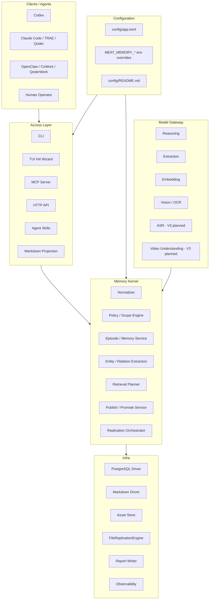

# Meat Memory Scheme V3

状态：Implementation Baseline + V3 Planning Draft

更新时间：2026-04-11

目标语言：Rust

目标开发环境：macOS / Docker / Cloud-ready Linux

相关文档：

- `docs/meat-memory-scheme-v1.md`
- `docs/meat-memory-scheme-v2.md`
- `docs/product-feature-structure.md`
- `docs/agent-integration-v1.md`
- `docs/api/cli-v1.md`
- `docs/api/mcp-v1.md`
- `docs/runbook/v2_1-quickstart.md`
- `docs/agent-skills/README.md`
- `config/README.md`

## 1. 文档定位

`Meat Memory Scheme V3` 是在 `V2` 设计文档基础上形成的当前工程基线与下一阶段规划稿。

`V1` 解决的是“系统应该长什么样”；`V2` 解决的是“如何真正开工实现”；`V3` 在本文件中的定位是：

- 总结最近已经完成的 `V2`、`V2.1` 和配置统一化工作
- 将实际落地的 CLI / MCP / TUI / Agent Skill / 报告体系纳入架构主文档
- 作为进入 `V3` 全多模态阶段之前的实现基线
- 明确从“文本 + 图片”扩展到“文本 + 图片 + 音频 + 视频”时需要补齐的任务边界

本文档中的 `V3` 同时包含两层含义：其一是方案文档版本 `Scheme V3`，用于描述当前系统最新形态；其二是产品版本 `V3`，对应 tasklist 中的音频、视频和全多模态扩展。

## 2. 最近工作总结

### 2.1 V2 已完成

`V2` 已从设计计划进入完成状态，核心交付包括：

- 多团队 / 个人 `Scope` 模型正式化
- scope owner、继承、同步元数据与层级校验
- scope-aware publish policy、review/candidate、redaction 与 promote 入口
- 多节点 merge 策略、冲突对象保留与 merge status 统计
- `FileReplicationEngine`、持久化 oplog state 与团队级同步语义
- 中英文 `language_code` 检测、双语 metadata 透传、英文抽取 / 检索 / 图谱支持
- V2 双语验收文档与 extract / kernel / HTTP / MCP / CLI 定向回归

### 2.2 V2.1 已完成

`V2.1` 的重点是把系统从“底层能力可用”推进到“Agent 和安装后用户可快速使用”。已完成内容包括：

- `memory-cli config show`
- `memory-cli config check`
- `memory-cli config check --database`
- `memory-cli mcp info`
- `memory-cli mcp info --check-http`
- `memory-cli skills export`
- `memory-cli tui init`
- `memory-cli tui init --interactive`
- 安装后 TUI 首步语言选择：`中文` / `English`
- TUI profile 选择：本地默认、MCP-ready、Markdown-first
- TUI 覆盖数据库、Markdown、资产目录、MCP 开关、默认语言、模型路由与 API Key env 配置
- TUI 支持编号模型候选菜单、review summary、确认写出和本地化最终结果面板
- Agent skill 模板覆盖 Codex、Claude Code / TRAE / Qoder、OpenClaw / CoWork / QoderWork 等接入类型
- skill bundle 包含 `SKILL.md`、`agents/openai.yaml` 和 `assets/icon.svg`
- V2.1 验收脚本 `scripts/v2_1-acceptance.sh` 覆盖 config / MCP / TUI / skill export smoke
- 测试报告体系通过 `scripts/write-test-reports.sh` 写入 `tests/reports/`

### 2.3 配置体系已统一

最近一次工程整理将应用配置从多文件形态收敛为单一主配置：

- 唯一应用主配置为 `config/app.toml`
- `config/default.toml` 已迁移为 `config/app.toml`
- `config/local.example.toml`、`config/docker.toml`、`config/cloud.example.toml` 已移除
- 本地、Docker、云端差异统一通过 `MEAT_MEMORY_*` 环境变量覆盖
- `memory-config` 已支持启动时环境变量覆盖
- `memory-cli` 默认读取 `config/app.toml`
- TUI 写出的本地覆盖建议使用 `config/app.local.toml` 或显式 `--output`
- `.env.example` 与 `compose.yaml` 已改为围绕 `config/app.toml` + 环境变量覆盖工作
- `config/README.md` 已补中文注释、中文使用方式和保留在仓库根目录的工具配置说明

仍保留在仓库根目录或工具约定位置的配置，例如 `Cargo.toml`、`.cargo/config.toml`、`rust-toolchain.toml`、`rustfmt.toml`、`clippy.toml`、GitHub workflow 与 `compose.yaml`，属于工具链要求，不并入 `config/`。

## 3. 当前系统状态

当前 `Meat Memory` 已具备以下可交付基线：

| 能力域 | 当前状态 |
|---|---|
| Rust workspace | 已拆分为 app / cli / config / kernel / storage / model / mcp / http / sync 等 crate |
| 存储 | PostgreSQL 结构化主存 + Markdown projection + 本地 asset store |
| 内核 | 支持 remember / search / publish / promote 等核心链路 |
| 多 Scope | 支持个人、团队、项目级隔离、发布和合并语义 |
| 多语言 | 支持中文 / 英文检测、metadata 透传和双语回归 |
| 多模态 | 当前覆盖文本 + 图片；音频 / 视频进入 V3 待办 |
| 接入层 | HTTP API、CLI、MCP、Markdown projection、Agent skill 模板 |
| 配置 | `config/app.toml` + `MEAT_MEMORY_*` 环境变量覆盖 + TUI 写出 |
| 运维 | Docker Compose、Helm skeleton、本地 / 云端 runbook、健康检查和 metrics |
| QA | 单测、集成测试、V1/V2.1 验收脚本、报告归档目录 |

## 4. 当前架构



## 5. 对象模型继承与变化

`Scheme V3` 继续继承 `Scheme V2` 的核心对象模型：

| 对象 | V2 设计定位 | V3 当前状态 |
|---|---|---|
| `Artifact` | 原始输入单位 | 已覆盖文本和图片；音频 / 视频待扩展 |
| `Episode` | 连续任务或会话聚合 | 保留为上下文聚合边界 |
| `Memory` | 长期知识对象 | 已进入 remember / search / publish 主链路 |
| `Entity` | 可归一化实体 | 已支持中英文抽取和图谱上下文 |
| `Relation` | 实体关系边 | 已支持关系抽取和检索上下文扩展 |
| `Evidence` | 支持 memory / relation 的证据链 | 已用于回溯；V3 需扩展时间轴 evidence |
| `Scope` | 隔离、共享、发布和同步边界 | V2 已正式化并进入持久化与策略层 |
| `Policy` | 权限、发布、脱敏和合并策略 | 已覆盖 publish / review / redaction / promote 基线 |
| `Projection` | 面向人类和 Agent 的投影 | Markdown projection 与 Agent skill 已落地 |
| `OplogEntry` | 同步操作日志 | 已用于 FileReplicationEngine 和持久化同步状态 |

## 6. 接入层基线

### 6.1 CLI

CLI 已从调试入口升级为日常入口。当前重点命令包括：

- `memory-cli remember`
- `memory-cli search`
- `memory-cli serve`
- `memory-cli config show`
- `memory-cli config check`
- `memory-cli config check --database`
- `memory-cli mcp info`
- `memory-cli mcp info --check-http`
- `memory-cli skills export`
- `memory-cli tui init`
- `memory-cli tui init --interactive`

### 6.2 TUI

TUI 当前是安装后初始化向导，而不是完整桌面 GUI。它承担三类职责：

- 帮助用户先选择语言，再完成 profile、数据库、Markdown、资产目录、MCP 和模型路由配置
- 生成可复核的配置摘要，并在确认后写入目标配置文件
- 给出下一步校验命令，例如 `MEAT_MEMORY_CONFIG=<path> memory-cli config check`

后续如果继续增强 TUI，优先方向是全屏交互、配置编辑回读、provider 分组、秘钥检测与运行状态面板。

### 6.3 MCP

MCP 作为 Agent 首选接入面继续保留。当前已具备工具发现、参数说明和 HTTP 连通性检查能力。V3 阶段需要在现有 text / image 能力上扩展音频和视频工具面。

### 6.4 Agent Skills

Agent skill 是 V2.1 的新增接入资产。当前模板按 Agent 类型分组：

- Codex：面向本地 Codex skill 安装和 HTTP memory 工作流
- Claude Code / TRAE / Qoder：面向协作型代码 Agent
- OpenClaw / CoWork / QoderWork：面向执行型 Agent

Skill 模板的目标不是替代 MCP，而是降低首次接入和日常提示成本，让 Agent 能快速知道何时记忆、何时检索、何时发布，以及如何做健康检查。

## 7. 配置模型

V3 当前工程基线采用单一应用主配置：

```text
config/
  README.md
  app.toml
```

推荐使用方式：

- 默认本地启动读取 `config/app.toml`
- 本地私有覆盖写入 `config/app.local.toml`，并通过 `MEAT_MEMORY_CONFIG=config/app.local.toml` 启动
- Docker / Cloud 环境读取镜像内 `/app/config/app.toml`，再通过 `MEAT_MEMORY_*` 注入运行时差异
- TUI 可以写出指定目标文件，便于把生成配置纳入本地私有覆盖

当前支持的主要环境变量覆盖包括：

- `MEAT_MEMORY_CONFIG`
- `MEAT_MEMORY_SERVER_BIND`
- `MEAT_MEMORY_LOG_LEVEL`
- `MEAT_MEMORY_LOG_FORMAT`
- `MEAT_MEMORY_MARKDOWN_ROOT`
- `MEAT_MEMORY_DATABASE_URL`
- `MEAT_MEMORY_ASSETS_ROOT`
- `MEAT_MEMORY_SYNC_MODE`
- `MEAT_MEMORY_SYNC_NODE_ID`
- `MEAT_MEMORY_SYNC_STATE_PATH`
- `MEAT_MEMORY_DEFAULT_LOCALE`
- `MEAT_MEMORY_ENABLE_PG`
- `MEAT_MEMORY_ENABLE_MARKDOWN`
- `MEAT_MEMORY_ENABLE_HTTP`
- `MEAT_MEMORY_ENABLE_MCP`

这次配置收敛的原则是：应用业务配置尽量进入 `config/app.toml`；环境差异通过 env 覆盖；工具链强约束配置保留在工具要求的位置。

## 8. QA 与报告体系

当前测试和报告入口包括：

| 入口 | 用途 |
|---|---|
| `cargo test --workspace --lib --bins --quiet` | Rust workspace 单测与 bin 测试主入口 |
| `cargo test -p memory-config --lib --quiet` | 配置层定向回归 |
| `cargo test -p memory-cli --bin memory-cli --quiet` | CLI / TUI 定向回归 |
| `scripts/v1-acceptance.sh` | V1 端到端验收 |
| `scripts/v2_1-acceptance.sh` | V2.1 CLI / MCP / TUI / skill smoke |
| `scripts/write-test-reports.sh` | 将各类测试报告归档到 `tests/reports/` |
| `docker compose config --quiet` | Compose 配置静态校验 |

最近配置统一化后，已完成的关键回归包括：

- `cargo fmt --all`
- `cargo test -p memory-config --lib --quiet`
- `cargo test -p memory-cli --bin memory-cli --quiet`
- `cargo run -p memory-cli -- config check`
- `docker compose config --quiet`
- `scripts/v2_1-acceptance.sh`

## 9. V3 产品版本目标

`V3` 产品版本的核心目标是补齐全多模态，使系统从“文本 + 图片”扩展到“文本 + 图片 + 音频 + 视频”。

### 9.1 音频链路

需要补齐：

- 音频 ingest
- 音频 asset metadata
- ASR provider 接入
- 转写文本与原始音频 evidence 绑定
- 音频片段级时间戳
- CLI / HTTP / MCP 音频写入入口

### 9.2 视频链路

需要补齐：

- 视频 ingest
- 视频 asset metadata
- 关键帧抽取
- 时间轴 evidence
- 视频 caption / multimodal extraction
- 视频片段到 Memory 的证据回溯
- CLI / HTTP / MCP 视频写入入口

### 9.3 全多模态检索

需要从当前文本和图片检索扩展为 late fusion 检索：

- 文本 lexical retrieval
- embedding semantic retrieval
- image-derived caption / OCR retrieval
- audio transcript retrieval
- video timeline / keyframe retrieval
- entity graph expansion
- rerank 与证据链汇总

### 9.4 Agent 工具面

V3 阶段需要让 Agent 能以统一方式处理全多模态：

- `remember_audio`
- `remember_video`
- `search_multimodal_context`
- `fetch_evidence`
- `publish_multimodal_memory`
- skill 模板中的音频 / 视频使用说明

## 10. 从 V2 到 V3 的迁移策略

迁移原则如下：

- 不破坏现有 `remember_text`、`remember_image`、`search`、`publish` 行为
- 音频和视频先进入 `Artifact` 与 asset store，再逐步接入 extraction 和 retrieval
- 所有新模态都必须保持 evidence 可回溯
- MCP / HTTP / CLI 的新增工具不应要求旧 Agent 修改已有文本工作流
- 配置继续遵循 `config/app.toml` + env override，不再增加 profile 配置文件
- 测试报告继续写入 `tests/reports/`，新增 V3 acceptance 报告目录

## 11. 风险与决策

| 项目 | 当前决策 | 风险 |
|---|---|---|
| TUI | 当前作为安装后初始化向导 | 还不是完整配置管理界面 |
| 配置 | 单一 `config/app.toml` + env 覆盖 | env 覆盖项需要持续文档化 |
| MCP | 当前覆盖文本主链路和工具发现 | 音频 / 视频 MCP schema 需要单独设计 |
| 多模态 | V1/V2 已覆盖文本 + 图片 | 音频 / 视频会引入大文件、转码、时间轴 evidence 和成本控制 |
| 模型 | 保持 provider 能力抽象 | ASR / 视频理解 provider 的能力差异较大 |
| 报告 | 已有测试报告目录和写入脚本 | V3 需要新增 multimodal acceptance 数据集 |

## 12. V3 验收标准建议

V3 完成时建议至少满足：

- 能通过 CLI 写入音频并生成可检索转写 Memory
- 能通过 HTTP 或 MCP 写入音频并回溯到原始音频 evidence
- 能通过 CLI 写入视频并生成关键帧 / 时间轴 evidence
- 能通过 HTTP 或 MCP 写入视频并生成可检索文本 projection
- 全多模态搜索能在同一查询中召回文本、图片、音频、视频来源
- Markdown projection 能以人类可读方式展示音频 / 视频 evidence
- `scripts/v3-acceptance.sh` 或等价验收脚本覆盖音频、视频、检索、发布和 Agent 工具面
- `scripts/write-test-reports.sh` 能将 V3 验收报告写入 `tests/reports/e2e/latest/`
- `docs/agent-skills/` 中的 skill 模板补充全多模态使用方式
- `config/README.md` 持续覆盖新增模型 provider 与 V3 相关 env 配置

## 13. 当前下一步

建议下一阶段按以下顺序推进：

1. 为 V3 音频 / 视频新增 object schema 和 asset metadata 细化文档
2. 先实现音频 ingest + ASR + transcript evidence
3. 再实现视频 ingest + keyframe + timeline evidence
4. 扩展检索 planner，加入 transcript / keyframe / timeline 召回
5. 扩展 CLI / HTTP / MCP 和 Agent skill 模板
6. 新增 V3 acceptance 脚本与报告目录

